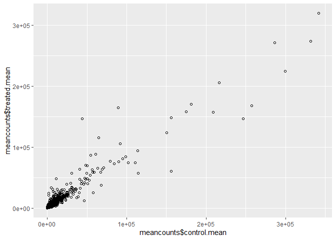
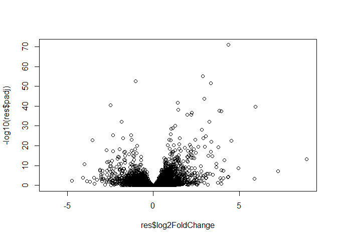

# Class12
Sarah Tareen

# 1. Bioconductor and DESeq2 setup

We used commands to install Bioconductor and the DESeq2 package in our
Rconsole so we can download them properly and answer no to any questions
about updates.

# 2. Import countData and colData

Lets download the csv files.

``` r
counts <- read.csv("airway_scaledcounts.csv", row.names=1)
#The ID column names of counts will be the rows of metadata
metadata <-  read.csv("airway_metadata.csv")

head(counts)
```

                    SRR1039508 SRR1039509 SRR1039512 SRR1039513 SRR1039516
    ENSG00000000003        723        486        904        445       1170
    ENSG00000000005          0          0          0          0          0
    ENSG00000000419        467        523        616        371        582
    ENSG00000000457        347        258        364        237        318
    ENSG00000000460         96         81         73         66        118
    ENSG00000000938          0          0          1          0          2
                    SRR1039517 SRR1039520 SRR1039521
    ENSG00000000003       1097        806        604
    ENSG00000000005          0          0          0
    ENSG00000000419        781        417        509
    ENSG00000000457        447        330        324
    ENSG00000000460         94        102         74
    ENSG00000000938          0          0          0

``` r
head(metadata)
```

              id     dex celltype     geo_id
    1 SRR1039508 control   N61311 GSM1275862
    2 SRR1039509 treated   N61311 GSM1275863
    3 SRR1039512 control  N052611 GSM1275866
    4 SRR1039513 treated  N052611 GSM1275867
    5 SRR1039516 control  N080611 GSM1275870
    6 SRR1039517 treated  N080611 GSM1275871

> **Q1.** How many genes are in this dataset?
>
> In this dataset there are 38694 genes.

``` r
nrow(counts)
```

    [1] 38694

There are 38,694 genes in the counts dataset.

> **Q2.** How many ‘control’ cell lines do we have?

There are 4 control cell lines.

# 3. Toy differential gene expression

Let’s start with exploratory analysis.

``` r
#We want to create a subset from the dex column of just the control rows.
# metadata[,"dex"]=="control" is a vector of TRUE and FALSE
control <- metadata[metadata[,"dex"]=="control",]

# we want to know the IDs of the control patients using control$id to select the columns of the counts dataset
control.counts <- counts[ ,control$id]
head(control.counts)
```

                    SRR1039508 SRR1039512 SRR1039516 SRR1039520
    ENSG00000000003        723        904       1170        806
    ENSG00000000005          0          0          0          0
    ENSG00000000419        467        616        582        417
    ENSG00000000457        347        364        318        330
    ENSG00000000460         96         73        118        102
    ENSG00000000938          0          1          2          0

``` r
#control.mean <- rowSums( control.counts )/4
control.mean <- rowMeans(control.counts)
head(control.mean)
```

    ENSG00000000003 ENSG00000000005 ENSG00000000419 ENSG00000000457 ENSG00000000460 
             900.75            0.00          520.50          339.75           97.25 
    ENSG00000000938 
               0.75 

> - **Q3.** How would you make the above code in either approach more
>   robust?

You can make the lab code (shown in the comment) more robust as shown
with the line of code that uses the `rowMeans` function so that this
line of code can be used for a data frame with any number of columns of
controls IDs.

> - **Q4.** Follow the same procedure for the `treated` samples
>   (i.e. calculate the mean per gene across drug treated samples and
>   assign to a labeled vector called `treated.mean`)

``` r
treated <- metadata[metadata[,"dex"]== 'treated',]

treated.counts <- counts[, treated$id]
head(treated.counts)
```

                    SRR1039509 SRR1039513 SRR1039517 SRR1039521
    ENSG00000000003        486        445       1097        604
    ENSG00000000005          0          0          0          0
    ENSG00000000419        523        371        781        509
    ENSG00000000457        258        237        447        324
    ENSG00000000460         81         66         94         74
    ENSG00000000938          0          0          0          0

``` r
treated.mean <- rowMeans(treated.counts)
head(treated.mean)
```

    ENSG00000000003 ENSG00000000005 ENSG00000000419 ENSG00000000457 ENSG00000000460 
             658.00            0.00          546.00          316.50           78.75 
    ENSG00000000938 
               0.00 

We can combine the mean counts.

``` r
meancounts <- data.frame(control.mean, treated.mean)
colSums(meancounts)
```

    control.mean treated.mean 
        23005324     22196524 

> **Q5 (a).** Create a scatter plot showing the mean of the treated
> samples against the mean of the control samples. Your plot should look
> something like the following.

``` r
plot(meancounts$control.mean, meancounts$treated.mean, xlab = "control.mean", ylab = "treated.mean")
```


> **Q5 (b).**You could also use the **ggplot2** package to make this
> figure producing the plot below. What **geom\_?()** function would you
> use for this plot?
>
> geom_point

``` r
library(ggplot2)
ggplot(meancounts, aes(x=meancounts$control.mean, 
                       y=meancounts$treated.mean)) + 
                   geom_point(shape = 21) 
```



There are supposed to be many more data points but they are all
clustered together so we need to change the scale.

> **Q6.** Try plotting both axes on a log scale. What is the argument to
> **plot()** that allows you to do this?
>
> log

``` r
plot(meancounts, log="xy")
```

    Warning in xy.coords(x, y, xlabel, ylabel, log): 15032 x values <= 0 omitted
    from logarithmic plot

    Warning in xy.coords(x, y, xlabel, ylabel, log): 15281 y values <= 0 omitted
    from logarithmic plot


``` r
# points that are off from the line can mean that the gene is expressed differently when treated with the drug
```

However, we get a warning because we cannot do logarithm of 0.

We can see the fold change increase in expression in genes when treated
with drug vs control.

- 20/20 = 1 same expression log2(1) = 0 so there are no differences in
  expression you get a 0

- 40/20 = 2 log2(2) = 1 double expression

- 10/20 = 1/2 log2(1/2) = -1 half the expression

To calculate the log2() of the fold change between treated and control…

``` r
#you can add a column to the dataframe without creating a new one
meancounts$log2fc <- log2(meancounts$treated.mean/
                            meancounts$control.mean)
head(meancounts)
```

                    control.mean treated.mean      log2fc
    ENSG00000000003       900.75       658.00 -0.45303916
    ENSG00000000005         0.00         0.00         NaN
    ENSG00000000419       520.50       546.00  0.06900279
    ENSG00000000457       339.75       316.50 -0.10226805
    ENSG00000000460        97.25        78.75 -0.30441833
    ENSG00000000938         0.75         0.00        -Inf

``` r
#the first row has less expression after treating it so we get a negative logarithm fold change
#NaN not a number because division by 0 does not exist, gene not expressed 
#-Inf -infinity because we cannot do log(0)
```

To get rid of the weird values we can remove zero values.

> - **Q7.** What is the purpose of the `arr.ind` argument in the
>   **which()** function call above? Why would we then take the first
>   column of the output and need to call the **unique()** function?
>
> The `arr.ind` argument gives the row and column of each zero value. We
> only take the first column of the output because it contains all the
> row numbers for each zero value, and if there is a zero in any row, we
> cannot take the log fold change number of it. Finally we call the
> `unique()` function to remove any repeat rows.

``` r
# we want to remove zeroes from the first two columns
#meancounts[,1:2] == 0

#arr.ind gives the row and column of the zero value
#which(meancounts[,1:2]==0, arr.ind=TRUE)

zero.vals <- which(meancounts[,1:2]==0, arr.ind=TRUE)
head(zero.vals)
```

                    row col
    ENSG00000000005   2   1
    ENSG00000004848  65   1
    ENSG00000004948  70   1
    ENSG00000005001  73   1
    ENSG00000006059 121   1
    ENSG00000006071 123   1

``` r
#We can get rid of the repeats of removing the values from the same rows.
to.rm <- unique(zero.vals[,1])
mycounts <- meancounts[-to.rm,]
head(mycounts)
```

                    control.mean treated.mean      log2fc
    ENSG00000000003       900.75       658.00 -0.45303916
    ENSG00000000419       520.50       546.00  0.06900279
    ENSG00000000457       339.75       316.50 -0.10226805
    ENSG00000000460        97.25        78.75 -0.30441833
    ENSG00000000971      5219.00      6687.50  0.35769358
    ENSG00000001036      2327.00      1785.75 -0.38194109

## Overexpressed and underexpressed genes

> **Q8.** Using the `up.ind` vector above can you determine how many up
> regulated genes we have at the greater than 2 fc level?
>
> There are 250 up regulated genes.

``` r
up.ind <- mycounts$log2fc > 2
table(up.ind)["TRUE"]
```

    TRUE 
     250 

> **Q9.** Using the `down.ind` vector above can you determine how many
> down regulated genes we have at the greater than 2 fc level?
>
> There are 367 down regulated genes.

``` r
down.ind <- mycounts$log2fc < (-2)
table(down.ind)['TRUE']
```

    TRUE 
     367 

> - **Q10.** Do you trust these results? Why or why not?
>
> We cannot say yes with certainty until we see some statistical
> analysis so we can tell if the differences in expression is
> significant using a value like p-values.

# 4. DESeq2 analysis

Let’s load the library.

``` r
library(DESeq2)
```

    Loading required package: S4Vectors

    Loading required package: stats4

    Loading required package: BiocGenerics


    Attaching package: 'BiocGenerics'

    The following objects are masked from 'package:stats':

        IQR, mad, sd, var, xtabs

    The following objects are masked from 'package:base':

        anyDuplicated, aperm, append, as.data.frame, basename, cbind,
        colnames, dirname, do.call, duplicated, eval, evalq, Filter, Find,
        get, grep, grepl, intersect, is.unsorted, lapply, Map, mapply,
        match, mget, order, paste, pmax, pmax.int, pmin, pmin.int,
        Position, rank, rbind, Reduce, rownames, sapply, setdiff, sort,
        table, tapply, union, unique, unsplit, which.max, which.min


    Attaching package: 'S4Vectors'

    The following objects are masked from 'package:base':

        expand.grid, I, unname

    Loading required package: IRanges


    Attaching package: 'IRanges'

    The following object is masked from 'package:grDevices':

        windows

    Loading required package: GenomicRanges

    Loading required package: GenomeInfoDb

    Loading required package: SummarizedExperiment

    Loading required package: MatrixGenerics

    Loading required package: matrixStats


    Attaching package: 'MatrixGenerics'

    The following objects are masked from 'package:matrixStats':

        colAlls, colAnyNAs, colAnys, colAvgsPerRowSet, colCollapse,
        colCounts, colCummaxs, colCummins, colCumprods, colCumsums,
        colDiffs, colIQRDiffs, colIQRs, colLogSumExps, colMadDiffs,
        colMads, colMaxs, colMeans2, colMedians, colMins, colOrderStats,
        colProds, colQuantiles, colRanges, colRanks, colSdDiffs, colSds,
        colSums2, colTabulates, colVarDiffs, colVars, colWeightedMads,
        colWeightedMeans, colWeightedMedians, colWeightedSds,
        colWeightedVars, rowAlls, rowAnyNAs, rowAnys, rowAvgsPerColSet,
        rowCollapse, rowCounts, rowCummaxs, rowCummins, rowCumprods,
        rowCumsums, rowDiffs, rowIQRDiffs, rowIQRs, rowLogSumExps,
        rowMadDiffs, rowMads, rowMaxs, rowMeans2, rowMedians, rowMins,
        rowOrderStats, rowProds, rowQuantiles, rowRanges, rowRanks,
        rowSdDiffs, rowSds, rowSums2, rowTabulates, rowVarDiffs, rowVars,
        rowWeightedMads, rowWeightedMeans, rowWeightedMedians,
        rowWeightedSds, rowWeightedVars

    Loading required package: Biobase

    Welcome to Bioconductor

        Vignettes contain introductory material; view with
        'browseVignettes()'. To cite Bioconductor, see
        'citation("Biobase")', and for packages 'citation("pkgname")'.


    Attaching package: 'Biobase'

    The following object is masked from 'package:MatrixGenerics':

        rowMedians

    The following objects are masked from 'package:matrixStats':

        anyMissing, rowMedians

``` r
# For citing the package you use.
citation("DESeq2")
```


    To cite package 'DESeq2' in publications use:

      Love, M.I., Huber, W., Anders, S. Moderated estimation of fold change
      and dispersion for RNA-seq data with DESeq2 Genome Biology 15(12):550
      (2014)

    A BibTeX entry for LaTeX users is

      @Article{,
        title = {Moderated estimation of fold change and dispersion for RNA-seq data with DESeq2},
        author = {Michael I. Love and Wolfgang Huber and Simon Anders},
        year = {2014},
        journal = {Genome Biology},
        doi = {10.1186/s13059-014-0550-8},
        volume = {15},
        issue = {12},
        pages = {550},
      }

Let’s generate the specific object that `DESeq2` needs:

``` r
dds <- DESeqDataSetFromMatrix(countData = counts, 
                              colData = metadata,
                              design = ~dex)
```

    converting counts to integer mode

    Warning in DESeqDataSet(se, design = design, ignoreRank): some variables in
    design formula are characters, converting to factors

``` r
#warning just tells us it converted the "control" and "treated" to factors
dds
```

    class: DESeqDataSet 
    dim: 38694 8 
    metadata(1): version
    assays(1): counts
    rownames(38694): ENSG00000000003 ENSG00000000005 ... ENSG00000283120
      ENSG00000283123
    rowData names(0):
    colnames(8): SRR1039508 SRR1039509 ... SRR1039520 SRR1039521
    colData names(4): id dex celltype geo_id

Now let’s run the analysis, which is doing all the math we did before
with the logarithms.

``` r
#We need to store the analysis in the same object.
dds <- DESeq(dds)
```

    estimating size factors

    estimating dispersions

    gene-wise dispersion estimates

    mean-dispersion relationship

    final dispersion estimates

    fitting model and testing

Now let’s check the results.

``` r
# Now we have p-values and adjusted p-values. We need the adjusted ones because we are comparing multiple values and the p-values can be misleading.
#Always use p adjusted!
res <- results(dds)
```

``` r
#This tells us the up and downregulated genes
# We can adjust the adjusted p-value using alpha
# We need to change the threshold for the log fold change because 
# by default its showing all significant changes

summary(res, alpha = 0.05)
```


    out of 25258 with nonzero total read count
    adjusted p-value < 0.05
    LFC > 0 (up)       : 1242, 4.9%
    LFC < 0 (down)     : 939, 3.7%
    outliers [1]       : 142, 0.56%
    low counts [2]     : 9971, 39%
    (mean count < 10)
    [1] see 'cooksCutoff' argument of ?results
    [2] see 'independentFiltering' argument of ?results

# 6. Data Visualization

``` r
#to make the more significant values appear on top use -log10 with base 10 so we can easily evaluate that 10 is p-value of 10^-10
plot(res$log2FoldChange, -log10(res$padj))
```



Let’s improve the plot.

``` r
plot( res$log2FoldChange,  -log(res$padj), 
 ylab="-Log(P-value)", xlab="Log2(FoldChange)")

# Add some cut-off lines
abline(v=c(-2,2), col="darkgray", lty=2)
abline(h=-log(0.05), col="darkgray", lty=2)
```


Let’s add color:)

``` r
# Setup our custom point color vector 
mycols <- rep("gray", nrow(res))
mycols[ abs(res$log2FoldChange) > 2 ]  <- "red" 

inds <- (res$padj < 0.01) & (abs(res$log2FoldChange) > 2 )
mycols[ inds ] <- "blue"

# Volcano plot with custom colors 
plot( res$log2FoldChange,  -log(res$padj), 
 col=mycols, ylab="-Log(P-value)", xlab="Log2(FoldChange)" )

# Cut-off lines
abline(v=c(-2,2), col="gray", lty=2)
abline(h=-log(0.1), col="gray", lty=2)
```


``` r
#red means that the fold change is high enough but not significant so focus on the blue
```
