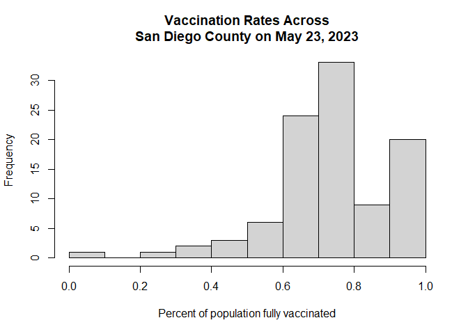
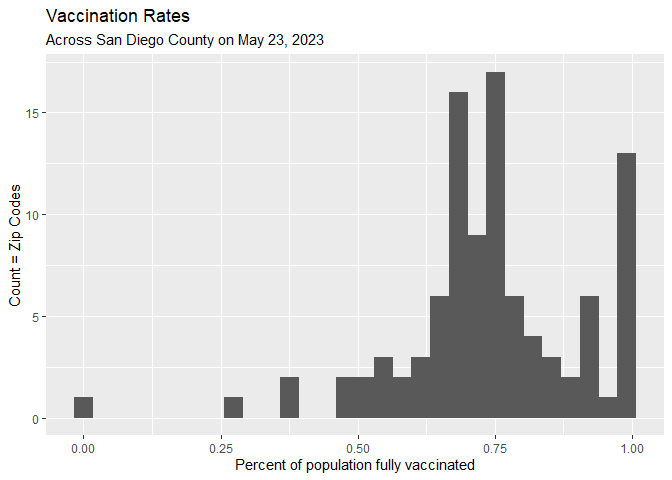
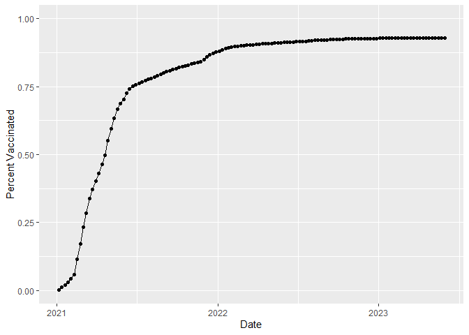
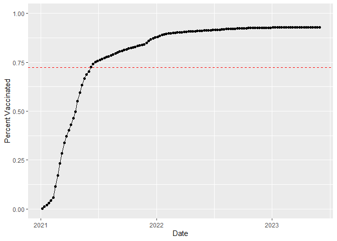
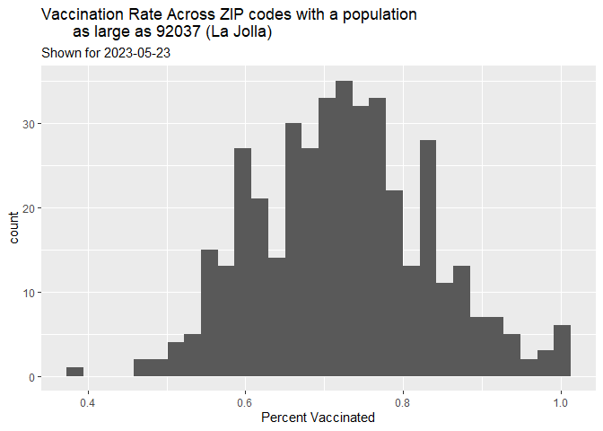
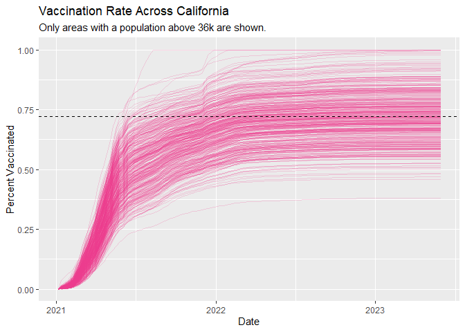

# Class 17 - Covid
Sarah Tareen

# Getting Started

``` r
# Import vaccination data
vax <- read.csv("covid19vaccinesbyzipcode_test (1).csv")
head(vax)
```

      as_of_date zip_code_tabulation_area local_health_jurisdiction     county
    1 2021-01-05                    93704                    Fresno     Fresno
    2 2021-01-05                    95684                 El Dorado  El Dorado
    3 2021-01-05                    92273                  Imperial   Imperial
    4 2021-01-05                    93662                    Fresno     Fresno
    5 2021-01-05                    95673                Sacramento Sacramento
    6 2021-01-05                    93668                    Fresno     Fresno
      vaccine_equity_metric_quartile                 vem_source
    1                              1 Healthy Places Index Score
    2                              2 Healthy Places Index Score
    3                              1 Healthy Places Index Score
    4                              1 Healthy Places Index Score
    5                              2 Healthy Places Index Score
    6                              1    CDPH-Derived ZCTA Score
      age12_plus_population age5_plus_population tot_population
    1               24803.5                27701          29740
    2                2882.9                 3104           3129
    3                1633.1                 1763           2010
    4               24501.3                28311          30725
    5               13671.7                15453          16636
    6                1013.4                 1199           1219
      persons_fully_vaccinated persons_partially_vaccinated
    1                       NA                           NA
    2                       NA                           NA
    3                       NA                           NA
    4                       NA                           NA
    5                       NA                           NA
    6                       NA                           NA
      percent_of_population_fully_vaccinated
    1                                     NA
    2                                     NA
    3                                     NA
    4                                     NA
    5                                     NA
    6                                     NA
      percent_of_population_partially_vaccinated
    1                                         NA
    2                                         NA
    3                                         NA
    4                                         NA
    5                                         NA
    6                                         NA
      percent_of_population_with_1_plus_dose booster_recip_count
    1                                     NA                  NA
    2                                     NA                  NA
    3                                     NA                  NA
    4                                     NA                  NA
    5                                     NA                  NA
    6                                     NA                  NA
      bivalent_dose_recip_count eligible_recipient_count
    1                        NA                        5
    2                        NA                        0
    3                        NA                        1
    4                        NA                        1
    5                        NA                        3
    6                        NA                        0
      eligible_bivalent_recipient_count
    1                                 5
    2                                 0
    3                                 0
    4                                 1
    5                                 3
    6                                 0
                                                                   redacted
    1 Information redacted in accordance with CA state privacy requirements
    2 Information redacted in accordance with CA state privacy requirements
    3 Information redacted in accordance with CA state privacy requirements
    4 Information redacted in accordance with CA state privacy requirements
    5 Information redacted in accordance with CA state privacy requirements
    6 Information redacted in accordance with CA state privacy requirements

> **Q1.** What column details the total number of people fully
> vaccinated?
>
> persons_fully_vaccinated
>
> **Q2.** What column details the Zip code tabulation area?
>
> zip_code_tabulation_area
>
> **Q3.** What is the earliest date in this dataset?

``` r
min(vax$as_of_date)
```

    [1] "2021-01-05"

> **Q4.** What is the latest date in this dataset?

``` r
vax[nrow(vax),1]
```

    [1] "2023-05-30"

Let’s take a look at the data.

``` r
library(skimr)
skimr::skim_without_charts(vax)
```

|                                                  |        |
|:-------------------------------------------------|:-------|
| Name                                             | vax    |
| Number of rows                                   | 222264 |
| Number of columns                                | 19     |
| \_\_\_\_\_\_\_\_\_\_\_\_\_\_\_\_\_\_\_\_\_\_\_   |        |
| Column type frequency:                           |        |
| character                                        | 5      |
| numeric                                          | 14     |
| \_\_\_\_\_\_\_\_\_\_\_\_\_\_\_\_\_\_\_\_\_\_\_\_ |        |
| Group variables                                  | None   |

Data summary

**Variable type: character**

| skim_variable             | n_missing | complete_rate | min | max | empty | n_unique | whitespace |
|:--------------------------|----------:|--------------:|----:|----:|------:|---------:|-----------:|
| as_of_date                |         0 |             1 |  10 |  10 |     0 |      126 |          0 |
| local_health_jurisdiction |         0 |             1 |   0 |  15 |   630 |       62 |          0 |
| county                    |         0 |             1 |   0 |  15 |   630 |       59 |          0 |
| vem_source                |         0 |             1 |  15 |  26 |     0 |        3 |          0 |
| redacted                  |         0 |             1 |   2 |  69 |     0 |        2 |          0 |

**Variable type: numeric**

| skim_variable                              | n_missing | complete_rate |     mean |       sd |    p0 |      p25 |      p50 |      p75 |     p100 |
|:-------------------------------------------|----------:|--------------:|---------:|---------:|------:|---------:|---------:|---------:|---------:|
| zip_code_tabulation_area                   |         0 |          1.00 | 93665.11 |  1817.38 | 90001 | 92257.75 | 93658.50 | 95380.50 |  97635.0 |
| vaccine_equity_metric_quartile             |     10962 |          0.95 |     2.44 |     1.11 |     1 |     1.00 |     2.00 |     3.00 |      4.0 |
| age12_plus_population                      |         0 |          1.00 | 18895.04 | 18993.87 |     0 |  1346.95 | 13685.10 | 31756.12 |  88556.7 |
| age5_plus_population                       |         0 |          1.00 | 20875.24 | 21105.96 |     0 |  1460.50 | 15364.00 | 34877.00 | 101902.0 |
| tot_population                             |     10836 |          0.95 | 23372.77 | 22628.50 |    12 |  2126.00 | 18714.00 | 38168.00 | 111165.0 |
| persons_fully_vaccinated                   |     17848 |          0.92 | 14299.49 | 15281.94 |    11 |   957.00 |  9034.00 | 23818.00 |  87721.0 |
| persons_partially_vaccinated               |     17848 |          0.92 |  1712.08 |  2075.03 |    11 |   164.00 |  1204.00 |  2551.00 |  43152.0 |
| percent_of_population_fully_vaccinated     |     22720 |          0.90 |     0.58 |     0.25 |     0 |     0.44 |     0.62 |     0.75 |      1.0 |
| percent_of_population_partially_vaccinated |     22720 |          0.90 |     0.08 |     0.09 |     0 |     0.05 |     0.06 |     0.08 |      1.0 |
| percent_of_population_with_1_plus_dose     |     23883 |          0.89 |     0.65 |     0.24 |     0 |     0.50 |     0.68 |     0.82 |      1.0 |
| booster_recip_count                        |     74543 |          0.66 |  6417.22 |  7795.13 |    11 |   331.00 |  3135.00 | 10344.00 |  60058.0 |
| bivalent_dose_recip_count                  |    160089 |          0.28 |  3438.22 |  4034.61 |    11 |   225.00 |  1863.00 |  5532.00 |  29593.0 |
| eligible_recipient_count                   |         0 |          1.00 | 13145.14 | 15144.22 |     0 |   537.00 |  6691.00 | 22558.00 |  87442.0 |
| eligible_bivalent_recipient_count          |         0 |          1.00 | 13038.24 | 15218.39 |     0 |   263.00 |  6583.00 | 22550.00 |  87442.0 |

> **Q5.** How many numeric columns are in this dataset?
>
> 14 numeric columns as we can see from the `skim` result.

``` r
# check how the data frame is structured
str(vax)
```

    'data.frame':   222264 obs. of  19 variables:
     $ as_of_date                                : chr  "2021-01-05" "2021-01-05" "2021-01-05" "2021-01-05" ...
     $ zip_code_tabulation_area                  : int  93704 95684 92273 93662 95673 93668 92262 91360 95664 93644 ...
     $ local_health_jurisdiction                 : chr  "Fresno" "El Dorado" "Imperial" "Fresno" ...
     $ county                                    : chr  "Fresno" "El Dorado" "Imperial" "Fresno" ...
     $ vaccine_equity_metric_quartile            : num  1 2 1 1 2 1 2 4 3 2 ...
     $ vem_source                                : chr  "Healthy Places Index Score" "Healthy Places Index Score" "Healthy Places Index Score" "Healthy Places Index Score" ...
     $ age12_plus_population                     : num  24804 2883 1633 24501 13672 ...
     $ age5_plus_population                      : int  27701 3104 1763 28311 15453 1199 27406 41111 1557 8534 ...
     $ tot_population                            : num  29740 3129 2010 30725 16636 ...
     $ persons_fully_vaccinated                  : num  NA NA NA NA NA NA NA 12 NA NA ...
     $ persons_partially_vaccinated              : num  NA NA NA NA NA ...
     $ percent_of_population_fully_vaccinated    : num  NA NA NA NA NA NA NA 0.000278 NA NA ...
     $ percent_of_population_partially_vaccinated: num  NA NA NA NA NA ...
     $ percent_of_population_with_1_plus_dose    : num  NA NA NA NA NA ...
     $ booster_recip_count                       : num  NA NA NA NA NA NA NA NA NA NA ...
     $ bivalent_dose_recip_count                 : num  NA NA NA NA NA NA NA NA NA NA ...
     $ eligible_recipient_count                  : int  5 0 1 1 3 0 3 12 0 1 ...
     $ eligible_bivalent_recipient_count         : int  5 0 0 1 3 0 3 12 0 1 ...
     $ redacted                                  : chr  "Information redacted in accordance with CA state privacy requirements" "Information redacted in accordance with CA state privacy requirements" "Information redacted in accordance with CA state privacy requirements" "Information redacted in accordance with CA state privacy requirements" ...

``` r
#check a specific column
class(vax$persons_fully_vaccinated)
```

    [1] "numeric"

> **Q6.** Note that there are “missing values” in the dataset. How many
> `NA` values there in the `persons_fully_vaccinated` column?

``` r
sum(is.na(vax$persons_fully_vaccinated))
```

    [1] 17848

> **Q7.** What percent of `persons_fully_vaccinated` values are missing
> (to 2 significant figures)?

``` r
(17711 / 220500)*100
```

    [1] 8.0322

> **Q8.** \[Optional\]: Why might this data be missing?
>
> Individual data points are not perfect and working with a huge amount
> of data has outliers which are not super important to the overall
> trend.

## Working with dates

``` r
library(lubridate)
```


    Attaching package: 'lubridate'

    The following objects are masked from 'package:base':

        date, intersect, setdiff, union

What is today’s date?

``` r
today()
```

    [1] "2023-06-12"

``` r
# Specify that we are using the year-month-day format
vax$as_of_date <- ymd(vax$as_of_date)
```

``` r
today() - vax$as_of_date[1]
```

    Time difference of 888 days

> **Q9.** How many days have passed since the last update of the
> dataset?

``` r
today() - vax$as_of_date[nrow(vax)]
```

    Time difference of 13 days

> **Q10.** How many unique dates are in the dataset (i.e. how many
> different dates are detailed)?

``` r
length(unique(vax$as_of_date))
```

    [1] 126

# Working with ZIP codes

``` r
library(zipcodeR)
```

``` r
geocode_zip('92037')
```

    # A tibble: 1 × 3
      zipcode   lat   lng
      <chr>   <dbl> <dbl>
    1 92037    32.8 -117.

We can find the distance between the centers of any two ZIP codes in
miles.

``` r
zip_distance('92037','92109')
```

      zipcode_a zipcode_b distance
    1     92037     92109     2.33

We can find information about specific zip codes.

``` r
reverse_zipcode(c('92037', "92109") )
```

    # A tibble: 2 × 24
      zipcode zipcode_type major_city post_office_city common_city_list county state
      <chr>   <chr>        <chr>      <chr>                      <blob> <chr>  <chr>
    1 92037   Standard     La Jolla   La Jolla, CA           <raw 20 B> San D… CA   
    2 92109   Standard     San Diego  San Diego, CA          <raw 21 B> San D… CA   
    # ℹ 17 more variables: lat <dbl>, lng <dbl>, timezone <chr>,
    #   radius_in_miles <dbl>, area_code_list <blob>, population <int>,
    #   population_density <dbl>, land_area_in_sqmi <dbl>,
    #   water_area_in_sqmi <dbl>, housing_units <int>,
    #   occupied_housing_units <int>, median_home_value <int>,
    #   median_household_income <int>, bounds_west <dbl>, bounds_east <dbl>,
    #   bounds_north <dbl>, bounds_south <dbl>

``` r
# Pull data for all ZIP codes in the dataset
#zipdata <- reverse_zipcode( vax$zip_code_tabulation_area )
```

# Focus on the San Diego area

There are two ways to focus on the San Diego area:

We can use base R functions.

``` r
# Subset to San Diego county only areas
sd <- vax[ vax$"county" == "San Diego",]
```

Or we can use the `dplyr` package.

``` r
library(dplyr)
```


    Attaching package: 'dplyr'

    The following objects are masked from 'package:stats':

        filter, lag

    The following objects are masked from 'package:base':

        intersect, setdiff, setequal, union

``` r
sd <- filter(vax, county == "San Diego")

nrow(sd)
```

    [1] 13482

`dplyr` is useful when you want multiple filters…

``` r
sd.10 <- filter(vax, county == "San Diego" &
                age5_plus_population > 10000)
```

> **Q11.** How many distinct zip codes are listed for San Diego County?

``` r
length(unique(sd$zip_code_tabulation_area))
```

    [1] 107

107 unique zip codes for San Diego county.

> Q12. What San Diego County Zip code area has the largest population in
> this dataset?

``` r
largest_zip_code <- sd[sd$tot_population == max(sd$tot_population, 
                                                na.rm = TRUE),]

unique(largest_zip_code$zip_code_tabulation_area)
```

    [1]    NA 92154

92154 has the largest San Diego population.

> **Q13.** What is the overall average (with 2 decimal numbers) “Percent
> of Population Fully Vaccinated” value for all San Diego “County” as of
> “2023-05-23”?

``` r
sd_recent <- filter(sd, as_of_date == "2023-05-23")
mean(sd_recent$percent_of_population_fully_vaccinated, na.rm = TRUE)
```

    [1] 0.7419992

> **Q14.** Using either ggplot or base R graphics make a summary figure
> that shows the distribution of Percent of Population Fully Vaccinated
> values as of “2023-05-23”?

``` r
#Base R
hist(sd_recent$percent_of_population_fully_vaccinated, 
     xlab = "Percent of population fully vaccinated", 
     main = "Vaccination Rates Across\nSan Diego County on May 23, 2023")
```



``` r
#ggplot2
library(ggplot2)
ggplot(sd_recent) + aes(x = percent_of_population_fully_vaccinated) + geom_histogram() + 
  labs(x= "Percent of population fully vaccinated", 
       y = "Count = Zip Codes", 
       title = "Vaccination Rates",
       subtitle = "Across San Diego County on May 23, 2023")
```

    `stat_bin()` using `bins = 30`. Pick better value with `binwidth`.

    Warning: Removed 8 rows containing non-finite values (`stat_bin()`).



## Focus on UCSD/La Jolla

Let’s filter to the UC San Diego in the 92037 ZIP code area and with an
age 5+ population size of 36,144.

``` r
ucsd <- filter(sd, zip_code_tabulation_area=="92037")
ucsd[1,]$age5_plus_population
```

    [1] 36144

> **Q15**. Using **ggplot** make a graph of the vaccination rate time
> course for the 92037 ZIP code area:

``` r
plot_92037 <- ggplot(ucsd) +
  aes(x=as_of_date,
      y=percent_of_population_fully_vaccinated) +
  geom_point() +
  geom_line(group=1) +
  ylim(c(0,1)) +
  labs(x="Date", y="Percent Vaccinated")
plot_92037
```



## Comparing to similar sized areas

> **Q16**. Calculate the mean *“Percent of Population Fully Vaccinated”*
> for ZIP code areas with a population as large as 92037 (La Jolla)
> *as_of_date* “2023-05-23”. Add this as a straight horizontal line to
> your plot from above with the `geom_hline()` function?

``` r
# Subset to all CA areas with a population as large as 92037
vax.36 <- filter(vax, age5_plus_population > 36144 &
                as_of_date == "2023-05-23")

head(vax.36)
```

      as_of_date zip_code_tabulation_area local_health_jurisdiction      county
    1 2023-05-23                    90805                Long Beach Los Angeles
    2 2023-05-23                    93257                    Tulare      Tulare
    3 2023-05-23                    90004               Los Angeles Los Angeles
    4 2023-05-23                    90808                Long Beach Los Angeles
    5 2023-05-23                    95355                Stanislaus  Stanislaus
    6 2023-05-23                    90802                Long Beach Los Angeles
      vaccine_equity_metric_quartile                 vem_source
    1                              1 Healthy Places Index Score
    2                              1 Healthy Places Index Score
    3                              1 Healthy Places Index Score
    4                              4 Healthy Places Index Score
    5                              2 Healthy Places Index Score
    6                              1 Healthy Places Index Score
      age12_plus_population age5_plus_population tot_population
    1               77165.9                88279          95995
    2               61519.8                70784          76519
    3               52412.5                57024          60541
    4               33952.3                37179          39330
    5               50941.6                56248          59621
    6               35238.1                37017          38962
      persons_fully_vaccinated persons_partially_vaccinated
    1                    62829                         6949
    2                    45117                         5629
    3                    47272                         5963
    4                    30283                         2375
    5                    39616                         3210
    6                    28152                         3711
      percent_of_population_fully_vaccinated
    1                               0.654503
    2                               0.589618
    3                               0.780826
    4                               0.769972
    5                               0.664464
    6                               0.722550
      percent_of_population_partially_vaccinated
    1                                   0.072389
    2                                   0.073563
    3                                   0.098495
    4                                   0.060386
    5                                   0.053840
    6                                   0.095247
      percent_of_population_with_1_plus_dose booster_recip_count
    1                               0.726892               33175
    2                               0.663181               22223
    3                               0.879321               29130
    4                               0.830358               20463
    5                               0.718304               22873
    6                               0.817797               17033
      bivalent_dose_recip_count eligible_recipient_count
    1                     10919                    62713
    2                      5297                    45104
    3                     12081                    47148
    4                      9676                    30203
    5                      8291                    39588
    6                      7169                    28107
      eligible_bivalent_recipient_count redacted
    1                             62713       No
    2                             45104       No
    3                             47148       No
    4                             30203       No
    5                             39588       No
    6                             28107       No

``` r
mean(vax.36$percent_of_population_fully_vaccinated)
```

    [1] 0.7226674

``` r
plot_92037 + geom_hline(yintercept=0.7226674, linetype="dashed", color="red")
```



> **Q17.** What is the 6 number summary (Min, 1st Qu., Median, Mean, 3rd
> Qu., and Max) of the *“Percent of Population Fully Vaccinated”* values
> for ZIP code areas with a population as large as 92037 (La Jolla)
> *as_of_date* “2023-05-23”?

``` r
summary(vax.36$percent_of_population_fully_vaccinated)
```

       Min. 1st Qu.  Median    Mean 3rd Qu.    Max. 
     0.3815  0.6470  0.7208  0.7227  0.7923  1.0000 

> **Q18.** Using ggplot generate a histogram of this data.

``` r
ggplot(vax.36) + aes(x=percent_of_population_fully_vaccinated) + geom_histogram() + 
  labs(x="Percent Vaccinated",
       title="Vaccination Rate Across ZIP codes with a population 
       as large as 92037 (La Jolla)",
       subtitle= "Shown for 2023-05-23")
```

    `stat_bin()` using `bins = 30`. Pick better value with `binwidth`.



> **Q19**. Is the 92109 and 92040 ZIP code areas above or below the
> average value you calculated for all these above?

``` r
vax %>% filter(as_of_date == "2023-05-23") %>%  
  filter(zip_code_tabulation_area=="92040") %>%
  select(percent_of_population_fully_vaccinated)
```

      percent_of_population_fully_vaccinated
    1                               0.552499

``` r
vax %>% filter(as_of_date == "2023-05-23") %>%  
  filter(zip_code_tabulation_area=="92109") %>%
  select(percent_of_population_fully_vaccinated)
```

      percent_of_population_fully_vaccinated
    1                               0.694763

The percentage of people fully vaccinated for the 92109 and 92040 ZIP
code areas are below the average value of the ZIP code areas with a
population as large as 92037 (La Jolla).

> **Q20.** Finally make a time course plot of vaccination progress for
> all areas in the full dataset with a `age5_plus_population > 36144`.

``` r
vax.36.all <- filter(vax, age5_plus_population > 36144)


ggplot(vax.36.all) +
  aes(x=as_of_date,
      y=percent_of_population_fully_vaccinated, 
      group=zip_code_tabulation_area) +
  geom_line(alpha=0.2, color="violetred2") +
  ylim(c(0,1)) +
  labs(x="Date", y="Percent Vaccinated",
       title="Vaccination Rate Across California",
       subtitle= "Only areas with a population above 36k are shown.") +
  geom_hline(yintercept = 0.7225892, linetype= "dashed")
```

    Warning: Removed 185 rows containing missing values (`geom_line()`).


