# Class 18 Cancer
Sarah Tareen

### Discussion 1 for Liver H**epatocellular Carcinomas**

> **Q.** How many cancer samples are included in the dataset?
>
> 372
>
> **Q.** Which is the most mutated gene?
>
> TTN
>
> **Q.** Which is the most common treatment undergone by patients?
>
> Sorafenib

## 3. Generating mutational matrices and visualizing mutational profiles

We need to load the matrix for the liver cancer samples.

``` r
# Read maf file
library(maftools)
mm_coad <- read.delim("liver.txt")
```

Plot the SBS96 profile.

``` r
# Generate mutational profiles (4 random samples)
library(MutationalPatterns)
```

    Loading required package: GenomicRanges

    Loading required package: stats4

    Loading required package: BiocGenerics


    Attaching package: 'BiocGenerics'

    The following objects are masked from 'package:stats':

        IQR, mad, sd, var, xtabs

    The following objects are masked from 'package:base':

        anyDuplicated, aperm, append, as.data.frame, basename, cbind,
        colnames, dirname, do.call, duplicated, eval, evalq, Filter, Find,
        get, grep, grepl, intersect, is.unsorted, lapply, Map, mapply,
        match, mget, order, paste, pmax, pmax.int, pmin, pmin.int,
        Position, rank, rbind, Reduce, rownames, sapply, setdiff, sort,
        table, tapply, union, unique, unsplit, which.max, which.min

    Loading required package: S4Vectors


    Attaching package: 'S4Vectors'

    The following objects are masked from 'package:base':

        expand.grid, I, unname

    Loading required package: IRanges


    Attaching package: 'IRanges'

    The following object is masked from 'package:grDevices':

        windows

    Loading required package: GenomeInfoDb

    Loading required package: NMF

    Loading required package: registry

    Loading required package: rngtools

    Loading required package: cluster

    NMF - BioConductor layer [OK] | Shared memory capabilities [NO: windows] | Cores 2/2


    Attaching package: 'NMF'

    The following object is masked from 'package:S4Vectors':

        nrun

``` r
# fixing the seed for random number generation
set.seed(11111) 

# selecting 4 random samples 
samples_to_plot = sample(1:ncol(mm_coad),4) 

plot_96_profile(mm_coad[,samples_to_plot], condensed = T)
```

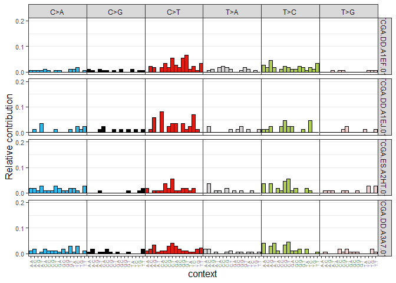

``` r
# Generate mutational profiles (top 4 mutated samples and top 4 less mutated)
mutations_in_samples = colSums(mm_coad)

#Sort the samples with highest number mutations on top
# can also use order() function
mutations_in_samples = sort(mutations_in_samples, 
                            decreasing = T)

# plot the top 4 mutated cases
samples_to_plot = names(mutations_in_samples)[1:4]
plot_96_profile(mm_coad[,samples_to_plot], condensed = T)
```

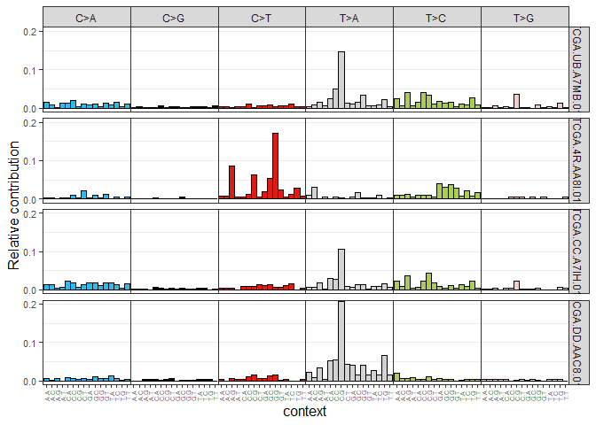

``` r
mutations_in_samples = sort(mutations_in_samples, decreasing = F)
samples_to_plot = names(mutations_in_samples)[1:4]
plot_96_profile(mm_coad[,samples_to_plot], condensed = T)
```

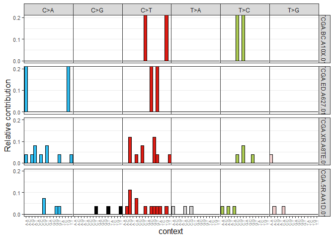

``` r
# Generate average mutational profiles
relative_mutational_profile = apply(mm_coad, 2, prop.table) # obtained relative

# mutational matrix
average_mutational_profile = rowMeans(relative_mutational_profile)
average_mutational_profile = data.frame(average_mutational_profile)
plot_96_profile(average_mutational_profile, condensed = T)
```

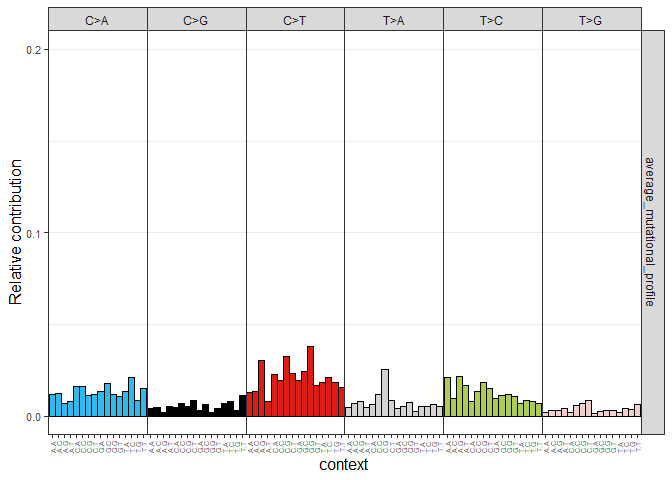

## 5. Assigning reference mutational signatures

We want to count the number of mutations for each signature (or cause of
mutation) for each sample so we can see what mutational processes have
been occurring.

``` r
# Mutational signature assignment

# Download the signatures with 96 mutation classifications and the signatures
# This is a probability distribution that the mutation caused by a signature belongs to that mutation classification.  
cosmic_signatures = get_known_signatures(source = 'COSMIC_v3.2')

# assign signatures, how many mutations of each signature we have is
# in the contribution column
fit_res = fit_to_signatures(mm_coad, cosmic_signatures)

# Top contributing signatures, access that column
# rows are samples, columns are signatures
contributions = fit_res$contribution

#take average of all the rows
top_contributing_signatures_abs = rowMeans(contributions)

#get the top 4 mutated ones
top_contributing_signatures_abs = sort(top_contributing_signatures_abs,
                                       decreasing = T)[1:4]

## Top 4 contributing signatures (absolute values)
# average number of mutations per signature in liver cancer
top_contributing_signatures_abs
```

        SBS22     SBS24     SBS26      SBS4 
    15.174219 13.283108  9.783660  8.506521 

Now we want the percentage of each type of mutation signature in the top
4. Every value will be divided by the sum of the column to get the
percentage. Percentages are more normalized for the number of mutations
in a sample.

``` r
# prop.table will show us the proportions, so each column should sum to 1
# apply to the whole matrix by column (2=columns)
relative_contributions = apply(contributions,2,prop.table)
top_contributing_signatures_rel = rowMeans(relative_contributions)
top_contributing_signatures_rel = sort(top_contributing_signatures_rel,
                                       decreasing = T)[1:4]

## Top 4 contributing signatures (relative values)
top_contributing_signatures_rel
```

         SBS24      SBS22      SBS26      SBS87 
    0.08643508 0.05763556 0.05750834 0.04976188 

The strict function is more accurate.

``` r
# Mutational signature assignment strict
fit_res_strict = fit_to_signatures_strict(mm_coad, cosmic_signatures)
fit_res_strict = fit_res_strict$fit_res
contributions_strict = fit_res_strict$contribution
```

## 6. Visualizing mutational signature assignment results

Lets see the mutational signature results using the `MutationalPatterns`
package.

``` r
# Visualization of signature assignment results (fit_to_signatures)
set.seed(11111)
samples_to_plot = sample(1:ncol(mm_coad),4)

plot_contribution(contributions[,samples_to_plot], mode = "absolute")
```

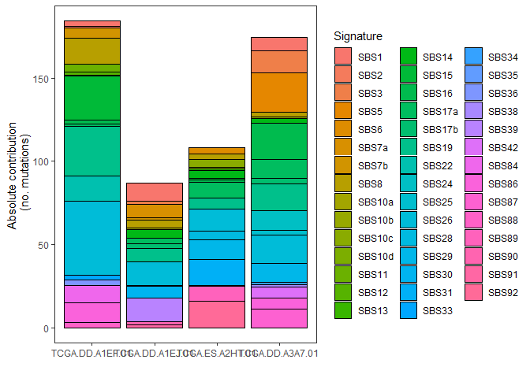

We can try another mode.

``` r
plot_contribution(contributions[,samples_to_plot], mode = "relative")
```

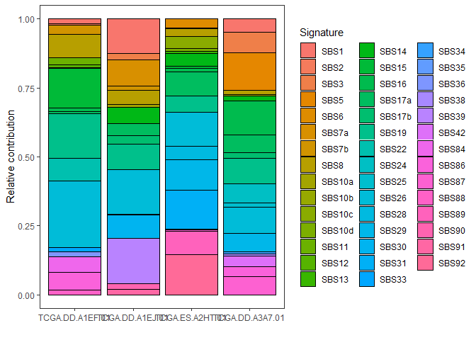

We can show this in a heatmap.

``` r
plot_contribution_heatmap(contributions, cluster_samples = F)
```

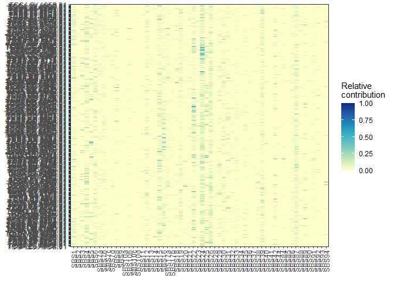

Let’s use the strict contribution results from part 5.

``` r
# Visualization of signature assignment results (strict)
plot_contribution(contributions_strict[,samples_to_plot], mode = "absolute")
```

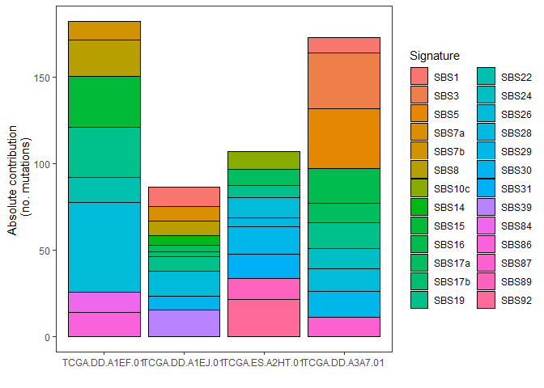

With a different mode as well.

``` r
plot_contribution(contributions_strict[,samples_to_plot], mode = "relative")
```

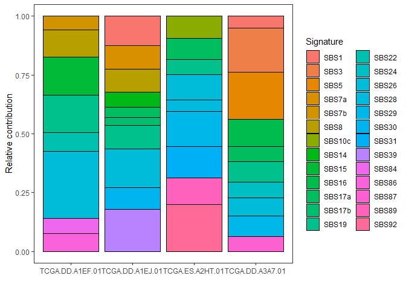

And make a heatmap again.

``` r
plot_contribution_heatmap(contributions_strict, cluster_samples = F)
```

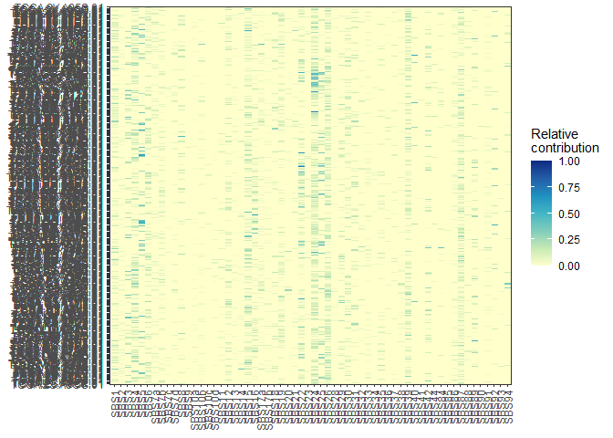

Let’s check the cosine similarity of this reconstruction to see how good
it is.

``` r
# Cosine similarity reconstruction vs. original mutational profile (fit_to_signatures)
set.seed(11111)
samples_to_plot = sample(1:ncol(mm_coad),4)

plot_original_vs_reconstructed(mm_coad[,samples_to_plot],
                               fit_res$reconstructed[,samples_to_plot], 
                               y_intercept = 0.90)
```

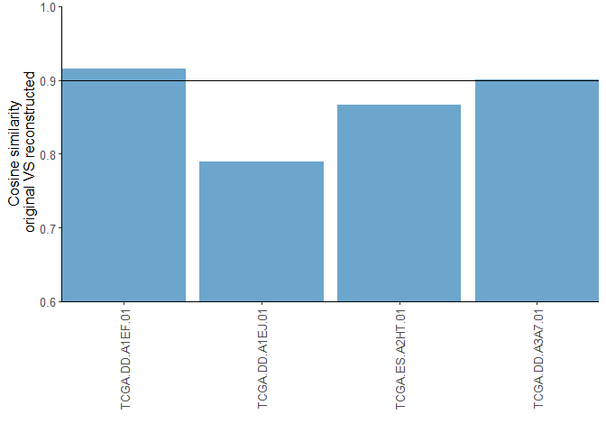

For the strict version as well.

``` r
# Cosine similarity reconstruction vs. original mutational profile (strict)
plot_original_vs_reconstructed(mm_coad[,samples_to_plot],
                               fit_res_strict$reconstructed[,samples_to_plot], 
                               y_intercept = 0.90)
```

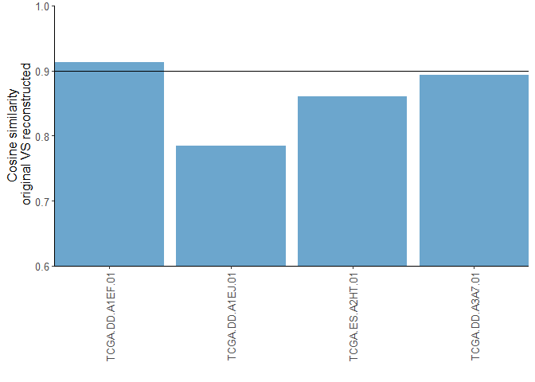

### Discussion 2

> **Q.** Which is the etiology of the top absolute contributing
> signature for liver cancer?
>
> Aristolochic acid
>
> **Q.** Which is the most prominent mutational context for the top
> contributing signature in skin cancer?
>
> C\>T
>
> **Q.** The etiology of the top contributing signature for lung cancer
> corresponds to an endogenous cellular mechanism. FALSE
>
> **Q.** SBS4 is one of the most common signatures found in lung cancer
> and is associated with tobacco smoking.
>
> TRUE
>
> **Q.** SBS7d is one of the most common signatures in skin cancer and
> is associated with UV light exposure and high numbers of C\>T
> mutations.
>
> FALSE
