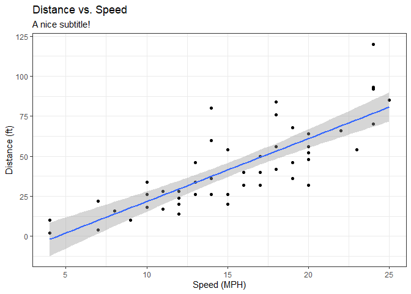
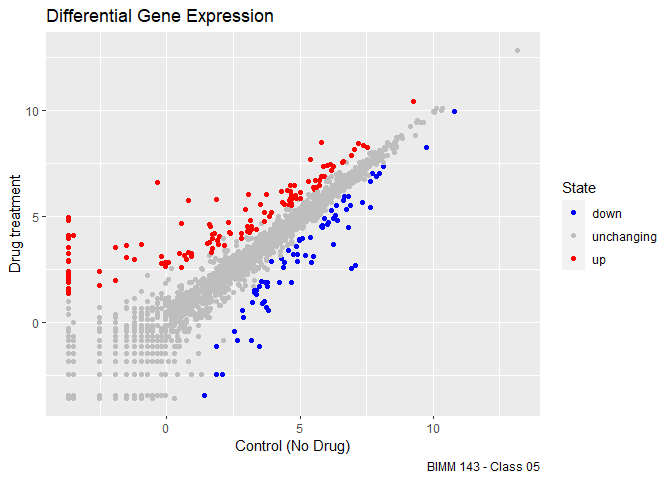

# Class 05: Data Visualization with GGPLOT
Sarah Tareen
2023-04-19

# Base R plotting

We are going to start by generating the plot of class 04. This code is
plotting the *cars* `dataset.`

``` r
plot(cars)
```


# GGPlot2

First, we need to install the package. We do this by using the
`install.packages` command.

``` r
#install.packages('ggplot2')
```

After that, we need to load the package.

``` r
library(ggplot2)
```

We are going to build the plot of the cars dataframe by using ggplot2.

``` r
 ggplot(data = cars)
```


``` r
 ggplot(data = cars) + aes(x=speed, y=dist)
```


``` r
 ggplot(data = cars) + aes(x=speed, y=dist) + geom_point()
```


``` r
 ggplot(data = cars) + aes(x=speed, y=dist) + geom_point() +       geom_smooth(method = 'lm') + labs(title = 'Distance vs. Speed', subtitle = 'A nice subtitle!', x = 'Speed (MPH)', y = "Distance (ft)") + theme_bw()
```

    `geom_smooth()` using formula = 'y ~ x'



**Q1.** For which phases is data visualization important in our
scientific workflows?

For Exploratory data analysis (EDA), detection of outliers, and
communication of results

**Q2.** True or False? The ggplot2 package comes already installed with
R?

False, you need to download the package.

**Q3.** Which plot types are typically NOT used to compare distributions
of numeric variables?

Network graphs are not used for numeric variables because they just show
connections between nodes.

**Q4.** Which statement about data visualization with ggplot2 is
incorrect?

It is incorrect that ggplot2 is the only way to create plots in R
because there is a command plot() for base R plotting as well.

# Plotting Gene Expression Data

Loading the data from the url:

``` r
url <- "https://bioboot.github.io/bimm143_S20/class-material/up_down_expression.txt"
genes <- read.delim(url)
head(genes)
```

            Gene Condition1 Condition2      State
    1      A4GNT -3.6808610 -3.4401355 unchanging
    2       AAAS  4.5479580  4.3864126 unchanging
    3      AASDH  3.7190695  3.4787276 unchanging
    4       AATF  5.0784720  5.0151916 unchanging
    5       AATK  0.4711421  0.5598642 unchanging
    6 AB015752.4 -3.6808610 -3.5921390 unchanging

Questions about the *genes* data frame:

**Q5.** Use the `nrow()` function to find out how many genes are in this
dataset. What is your answer? There are 5196 rows.

``` r
nrow(genes)
```

    [1] 5196

**Q6.** Use the `colnames()` function and the `ncol()` function on the
`genes` data frame to find out what the column names are (we will need
these later) and how many columns there are. How many columns did you
find?

I found 4 columns. The names of the columns are *Gene, Condition 1,
Condition 2,* and *State*.

``` r
colnames(genes)
```

    [1] "Gene"       "Condition1" "Condition2" "State"     

``` r
ncol(genes)
```

    [1] 4

**Q7.** Use the `table()` function on the `State` column of this
data.frame to find out how many ‘up’ regulated genes there are. What is
your answer?

There are 127 up-regulated genes.

``` r
table(genes[,'State'])
```


          down unchanging         up 
            72       4997        127 

**Q8.** Using your values above and 2 significant figures. What fraction
of total genes is up-regulated in this dataset?

About 2.4% of the total genes are up-regulated.

``` r
round(table(genes[,'State']) / nrow(genes) * 100, 2)
```


          down unchanging         up 
          1.39      96.17       2.44 

Initial ggplot:

``` r
ggplot(data = genes) + aes(x=Condition1, y=Condition2) + geom_point()
```


Adding color to the plot:

``` r
p1 <- ggplot(data = genes) + aes(x=Condition1, y  =Condition2, col=State) + geom_point()

p1
```


Let’s change the color scheme:

``` r
p2 = p1 + scale_color_manual(values = c('blue', 'gray', 'red'))

p2
```


Let’s add some labels:

``` r
p2 + labs(title = 'Differential Gene Expression', 
          x = 'Control (No Drug)',
          y = "Drug treatment",
          caption = "BIMM 143 - Class 05")
```


