# Class 7: Machine Learning
Sarah Tareen

## Example of K-means clustering

First step is to make up some data with a known structure, so we know
what the answer should be. \`\`\`

``` r
#Make two clear subgroups of points
tmp <- c( rnorm(30, mean = -3), rnorm(30, mean = 3))
x <- cbind(x = tmp, y = rev(tmp))
plot(x)
```

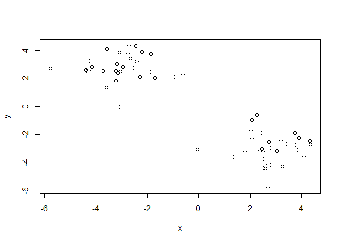

Now we have some structured data in `x`. Let’s see if k-means is able to
identify the two groups.

``` r
k <- kmeans(x, centers = 2, nstart = 20)
k
```

    K-means clustering with 2 clusters of sizes 30, 30

    Cluster means:
              x         y
    1 -2.999478  2.780142
    2  2.780142 -2.999478

    Clustering vector:
     [1] 1 1 1 1 1 1 1 1 1 1 1 1 1 1 1 1 1 1 1 1 1 1 1 1 1 1 1 1 1 1 2 2 2 2 2 2 2 2
    [39] 2 2 2 2 2 2 2 2 2 2 2 2 2 2 2 2 2 2 2 2 2 2

    Within cluster sum of squares by cluster:
    [1] 58.53841 58.53841
     (between_SS / total_SS =  89.5 %)

    Available components:

    [1] "cluster"      "centers"      "totss"        "withinss"     "tot.withinss"
    [6] "betweenss"    "size"         "iter"         "ifault"      

Let’s explore `k`:

``` r
# size shows you how points are in each cluster
k$size
```

    [1] 30 30

``` r
# this shows the center of each cluster
k$centers
```

              x         y
    1 -2.999478  2.780142
    2  2.780142 -2.999478

``` r
# which point belongs to which cluster
k$cluster
```

     [1] 1 1 1 1 1 1 1 1 1 1 1 1 1 1 1 1 1 1 1 1 1 1 1 1 1 1 1 1 1 1 2 2 2 2 2 2 2 2
    [39] 2 2 2 2 2 2 2 2 2 2 2 2 2 2 2 2 2 2 2 2 2 2

``` r
# gives a different color to each cluster based on which points are in it 
plot(x, col = k$cluster)
```

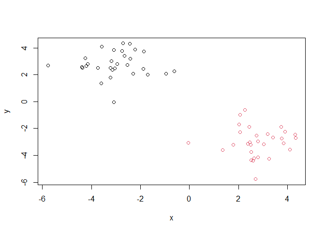

Now we can add the clusters centers:

``` r
plot(x, col = k$cluster)
# this command adds to the plot, calling plot again will just make a new plot, can change the color and shape of these added points as well
points(k$centers, col = 'blue', pch = 15)
```

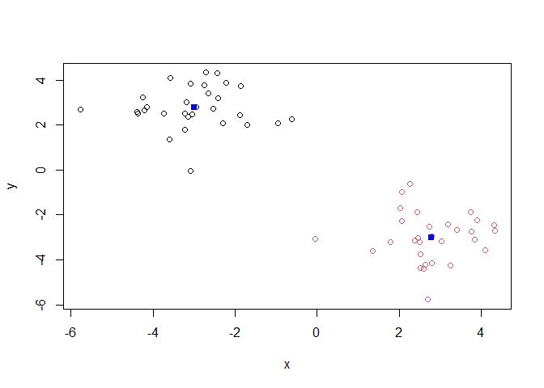

This method’s disadvantage is that you need to know the number of
clusters initially because k will run with the number you tell it to.

Here is an example when we select the wrong number of clusters for
k-means:

``` r
# 3 clusters does not make sense
k3 <- kmeans(x, centers = 3, nstart = 20)
plot(x, col = k3$cluster)
```

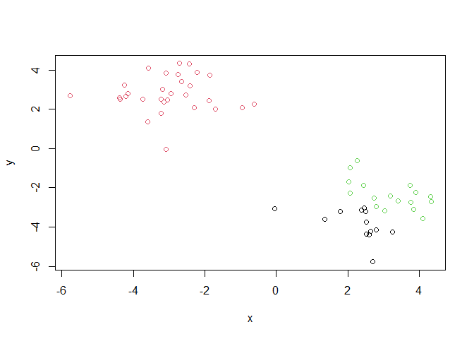

# Example of Hierarchical Clustering

Let’s use the same data as before, which we stored in `x`. We will use
the `hclust` function.

``` r
#dist calculates the distances between all the point and this is the input for hclust
clustering <- hclust(dist(x))
clustering
```


    Call:
    hclust(d = dist(x))

    Cluster method   : complete 
    Distance         : euclidean 
    Number of objects: 60 

``` r
# we can see two distinct groups with numbers 1-30 on the left and 31-60 on the right
plot(clustering)
```

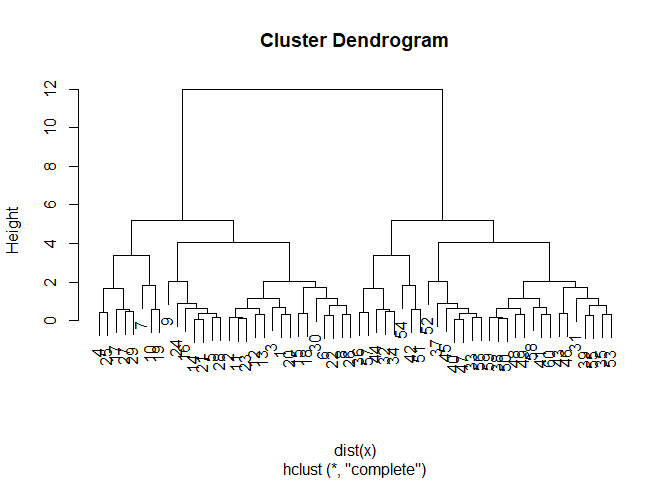

Let’s add a horizontal line:

``` r
# We can use this line to define our clusters
# Don't overexplain the data to find patterns that may not be there or overclassify too specific to your data set. 
# We should be able to apply logic to other data sets
plot(clustering)
abline(h = 10, col = "pink")
```

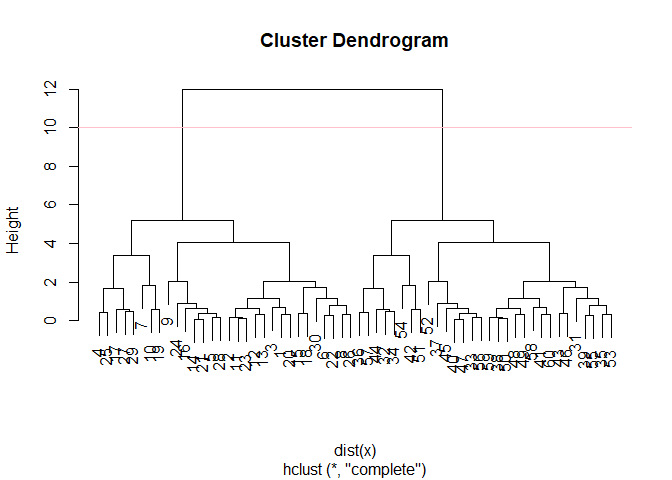

To get our results (i.e., membership vector) we need to “cut” the tree.
The function for doing that is `cutree()`.

``` r
subgroups <- cutree(clustering, h = 10)
subgroups
```

     [1] 1 1 1 1 1 1 1 1 1 1 1 1 1 1 1 1 1 1 1 1 1 1 1 1 1 1 1 1 1 1 2 2 2 2 2 2 2 2
    [39] 2 2 2 2 2 2 2 2 2 2 2 2 2 2 2 2 2 2 2 2 2 2

``` r
plot(x, col = subgroups)
```


You can also “cut” your tree with the number of clusters you want:

``` r
 subgroups2 <- cutree(clustering, k = 2)
 subgroups2
```

     [1] 1 1 1 1 1 1 1 1 1 1 1 1 1 1 1 1 1 1 1 1 1 1 1 1 1 1 1 1 1 1 2 2 2 2 2 2 2 2
    [39] 2 2 2 2 2 2 2 2 2 2 2 2 2 2 2 2 2 2 2 2 2 2

# Principal Component Analysis (PCA)

## PCA of UK food data

First we want to read the data.

``` r
url <- "https://tinyurl.com/UK-foods"
x <- read.csv(url, row.names = 1)
head(x)
```

                   England Wales Scotland N.Ireland
    Cheese             105   103      103        66
    Carcass_meat       245   227      242       267
    Other_meat         685   803      750       586
    Fish               147   160      122        93
    Fats_and_oils      193   235      184       209
    Sugars             156   175      147       139

\>Q1. How many rows and columns are in your new data frame named `x`?
What R functions could you use to answer this questions?

``` r
# dim() returns rows and columns
dim(x)
```

    [1] 17  4

There are 17 rows and 4 columns.

\>Q2. Which approach to solving the ‘row-names problem’ mentioned above
do you prefer and why? Is one approach more robust than another under
certain circumstances?

I used the approach that set `rownames=1` because it was more simple and
easier to understand. One might be more robust since if you run
`x <- x[,-1]` multiple times you can remove more columns if desired but
its also easier to choose one of the columns to set `rownames` to which
deletes that column as well.

Now we can generate some basic visualizations.

\>Q3. Changing what optional argument in the above **`barplot()`**
function results in the following plot? Changing the argument `col`
resulted in this colorful plot based on the food categories of the rows.

``` r
barplot(as.matrix(x), col = rainbow( nrow(x) ))
```


Let’s refine our barplot:

``` r
barplot(as.matrix(x), col = rainbow( nrow(x) ), beside = T)
```


Other visualizations that can be useful…

\>Q5. Generating all pairwise plots may help somewhat. Can you make
sense of the following code and resulting figure? What does it mean if a
given point lies on the diagonal for a given plot?

The code is making a plot that gives a different color to each category
in the rows. This pairwise plot is plotting each variable against each
other. For example, in the top row, the first plot is England vs. Wales,
the second is England vs. Scotland, and the third is England vs Northern
Ireland. These plots can be repeated in other rows. If a point lies
along the diagonal of a plot, it means that there is a high correlation
for the point between the two variables being plotted against each
other.

``` r
pairs(x, col = rainbow( nrow(x) ))
```


\>Q6. What is the main differences between N. Ireland and the other
countries of the UK in terms of this data-set?

The main difference is that in Northern Ireland people are more likely
to eat potatoes and drink soft drinks in higher proportions than the
other three countries in the UK.

## PCA to the rescue

Let’s apply PCA (principal components analysis). For that, we need to
use the command `prcomp()`. This function expects the transpose of our
data.

``` r
pca <- prcomp(t(x))
summary(pca)
```

    Importance of components:
                                PC1      PC2      PC3       PC4
    Standard deviation     324.1502 212.7478 73.87622 4.189e-14
    Proportion of Variance   0.6744   0.2905  0.03503 0.000e+00
    Cumulative Proportion    0.6744   0.9650  1.00000 1.000e+00

``` r
# in just two dimensions we can see 96% of the data we observed with the 17 dimensions
# we don't need all 17 dimensions, we can just use these two
```

Let’s plot the PCA results:

``` r
# This plot just shows us the 4 components and their variances. Its just a visual representation of the summary. 
plot(pca)
```


We need to access the results of the PCA analysis.

``` r
# tells you what is in pca, x are the coordinates of the principal components
attributes(pca)
```

    $names
    [1] "sdev"     "rotation" "center"   "scale"    "x"       

    $class
    [1] "prcomp"

We can explore the `pca$x` dataframe:

``` r
pca$x
```

                     PC1         PC2         PC3           PC4
    England   -144.99315    2.532999 -105.768945  2.842865e-14
    Wales     -240.52915  224.646925   56.475555  7.804382e-13
    Scotland   -91.86934 -286.081786   44.415495 -9.614462e-13
    N.Ireland  477.39164   58.901862    4.877895  1.448078e-13

Plotting:

``` r
#variation in the x axis is much higher than the y axis because the x axis is PCA 1
plot( x=pca$x[,1], y=pca$x[,2], xlab="PC1", ylab="PC2", xlim=c(-270,500))
```

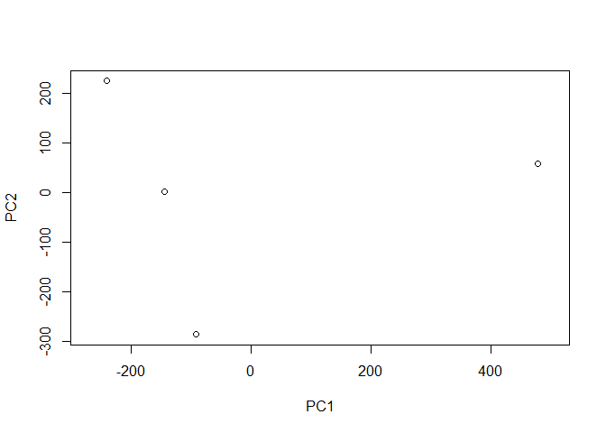

\>Q8. Customize your plot so that the colors of the country names match
the colors in our UK and Ireland map and table at start of this
document.

``` r
#these two give the same names
#colnames(x)
#rownames(pca$x)
plot( x=pca$x[,1], y=pca$x[,2] )
#can choose specific colors instead of just random rainbow colors
colors_countries <- c('orange', 'pink', 'blue', 'green')
text( x=pca$x[,1], y=pca$x[,2], colnames(x), col = colors_countries)
```

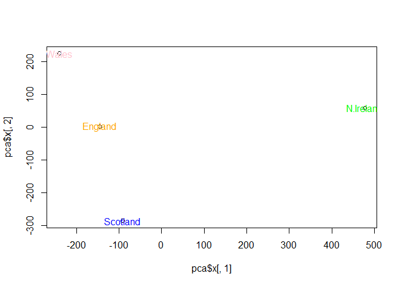

Let’s see how each variable affected the PCs using something called
loading scores which can be found in the `rotation` component of the
PCA.

``` r
## Lets focus on PC1 as it accounts for > 90% of variance 
par(mar=c(10, 3, 0.35, 0))
barplot( pca$rotation[,1], las=2 )
```


\>Q9. Generate a similar ‘loadings plot’ for PC2. What two food groups
feature prominantely and what does PC2 mainly tell us about?

``` r
par(mar=c(10, 3, 0.35, 0))
barplot( pca$rotation[,2], las=2 )
```


The two food groups that feature prominently are fresh potatoes and soft
drinks. PC2 mainly tells us about how Northern Ireland peoples’ food
choices differ from the rest of the countries in the UK.

# PCA of a RNA-Seq Dataset

First step as always is loading the data.

``` r
url2 <- "https://tinyurl.com/expression-CSV"
rna.data <- read.csv(url2, row.names=1)
```

**\>Q10**: How many genes and samples are in this data set?

``` r
dim( rna.data )
```

    [1] 100  10

I have 100 genes and 10 samples.

Let’s apply PCA:

``` r
pca_rna = prcomp( t(rna.data) )
#Just one dimension PCA1 explains 99% of the differences in the data. 
summary(pca_rna)
```

    Importance of components:
                                 PC1     PC2      PC3      PC4      PC5      PC6
    Standard deviation     2214.2633 88.9209 84.33908 77.74094 69.66341 67.78516
    Proportion of Variance    0.9917  0.0016  0.00144  0.00122  0.00098  0.00093
    Cumulative Proportion     0.9917  0.9933  0.99471  0.99593  0.99691  0.99784
                                PC7      PC8      PC9      PC10
    Standard deviation     65.29428 59.90981 53.20803 3.142e-13
    Proportion of Variance  0.00086  0.00073  0.00057 0.000e+00
    Cumulative Proportion   0.99870  0.99943  1.00000 1.000e+00

Let’s plot the principal components 1 and 2.

``` r
plot( pca_rna$x[,1], pca_rna$x[,2], xlab = 'PCA1', ylab = 'PCA2')
```

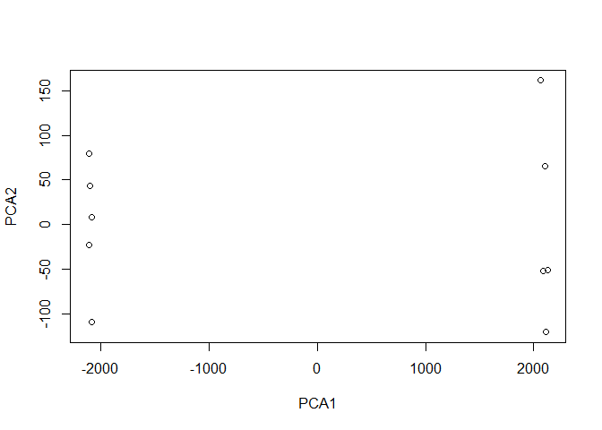

``` r
colnames(rna.data)
```

     [1] "wt1" "wt2" "wt3" "wt4" "wt5" "ko1" "ko2" "ko3" "ko4" "ko5"

``` r
cols_samples <- c(rep('blue', 5), rep('red', 5))
cols_samples
```

     [1] "blue" "blue" "blue" "blue" "blue" "red"  "red"  "red"  "red"  "red" 

``` r
#can see very clearly the groups of wildtype and knockout gene 
#can use this as quality control in an experiment
plot( pca_rna$x[,1], pca_rna$x[,2], xlab = 'PCA1', ylab = 'PCA2', col = cols_samples)
```

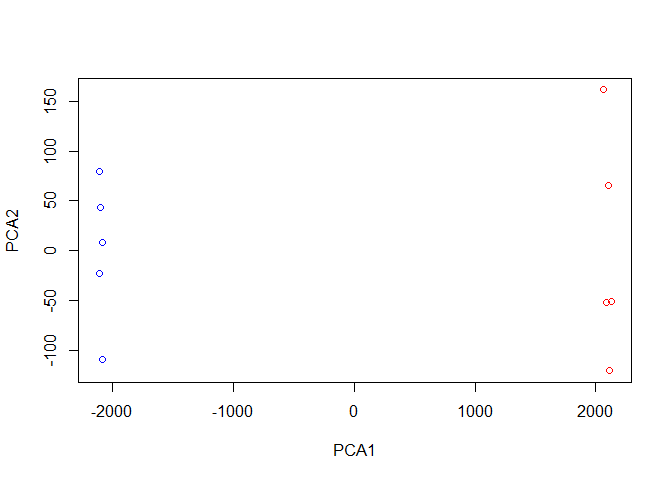

``` r
barplot(pca_rna$rotation[,1])
```

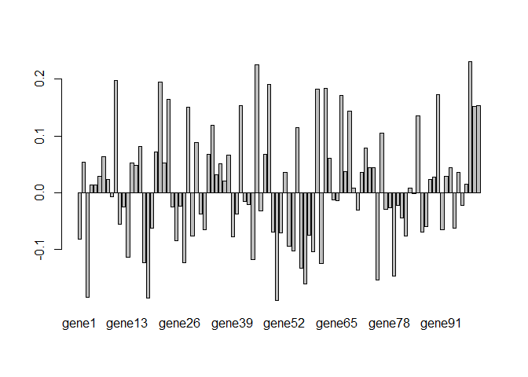

``` r
#can see over and underexpression of genes by sorting
sort(pca_rna$rotation[,1])
```

          gene50       gene18        gene3       gene57       gene75       gene79 
    -0.188796985 -0.185668500 -0.183374164 -0.160771014 -0.153164404 -0.146803635 
          gene56       gene61       gene27       gene17       gene44       gene13 
    -0.132330117 -0.124572881 -0.123615228 -0.122536548 -0.117808971 -0.113357525 
          gene59       gene54       gene53       gene25        gene1       gene39 
    -0.103935563 -0.102503320 -0.093979884 -0.083761992 -0.081247810 -0.077306742 
          gene82       gene29       gene58       gene51       gene49       gene86 
    -0.076658760 -0.075605635 -0.075274651 -0.069855142 -0.069530208 -0.069165267 
          gene91       gene32       gene19       gene94       gene87       gene11 
    -0.065288752 -0.064721235 -0.062411218 -0.061938300 -0.059547317 -0.055698801 
          gene81       gene40       gene31       gene46       gene70       gene77 
    -0.043780416 -0.037323670 -0.037219970 -0.031990529 -0.030784982 -0.029225446 
          gene78       gene24       gene12       gene26       gene96       gene80 
    -0.025639741 -0.025407507 -0.024870802 -0.022868107 -0.022293151 -0.021824860 
          gene43       gene42       gene65       gene64        gene9       gene84 
    -0.020617052 -0.014550791 -0.014052839 -0.012639567 -0.007495075 -0.001289937 
          gene83       gene69        gene4        gene5       gene97       gene37 
     0.008504287  0.008871890  0.014242602  0.014303808  0.014994546  0.021280555 
          gene88        gene8       gene89        gene6       gene92       gene35 
     0.024015925  0.024026657  0.027652967  0.028634131  0.029394259  0.031349942 
          gene95       gene71       gene52       gene67       gene74       gene73 
     0.035342407  0.035589259  0.035802086  0.037840851  0.044286948  0.044581700 
          gene93       gene15       gene36       gene14       gene22        gene2 
     0.044940861  0.049090676  0.051765605  0.052004194  0.053013523  0.053465569 
          gene63        gene7       gene38       gene47       gene33       gene20 
     0.060529157  0.063389255  0.066665407  0.067141911  0.068437703  0.071571203 
          gene72       gene16       gene30       gene76       gene55       gene34 
     0.078551648  0.081254592  0.089150461  0.104435777  0.114988217  0.119604059 
          gene85       gene68       gene28       gene99      gene100       gene41 
     0.134907896  0.144227333  0.150812015  0.151678253  0.152877246  0.153077075 
          gene23       gene66       gene90       gene60       gene62       gene48 
     0.165155192  0.171311307  0.173156806  0.183139926  0.184203008  0.190495289 
          gene21       gene10       gene45       gene98 
     0.194884023  0.197905454  0.225149201  0.230633225 
