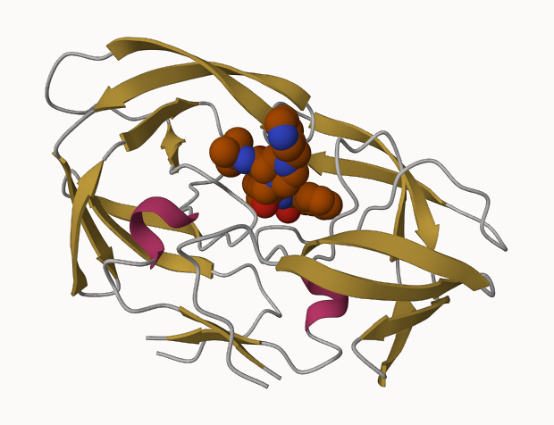

# Class09_lab
Sarah Tareen

# 1: Introduction to the RCSB Protein Data Bank (PDB)

## PDB statistics

We are moving the CSV file into RStudio and reading it using `read.csv`.

``` r
url <- "Data Export Summary.csv"
pdb.data <- read.csv(url, row.names = 1)
pdb.data
```

                              X.ray     EM    NMR Multiple.methods Neutron Other
    Protein (only)          154,766 10,155 12,187              191      72    32
    Protein/Oligosaccharide   9,083  1,802     32                7       1     0
    Protein/NA                8,110  3,176    283                6       0     0
    Nucleic acid (only)       2,664     94  1,450               12       2     1
    Other                       163      9     32                0       0     0
    Oligosaccharide (only)       11      0      6                1       0     4
                              Total
    Protein (only)          177,403
    Protein/Oligosaccharide  10,925
    Protein/NA               11,575
    Nucleic acid (only)       4,223
    Other                       204
    Oligosaccharide (only)       22

> **Q1:** What percentage of structures in the PDB are solved by X-Ray
> and Electron Microscopy.
>
> I need to sum all the elements of the X.ray column.

``` r
# R is understanding that these are letters because there are commas
pdb.data$X.ray
```

    [1] "154,766" "9,083"   "8,110"   "2,664"   "163"     "11"     

We are going to use `gsub` to remove the commas. Then we can convert to
numbers.

``` r
#replace the commas with nothing (empty string)
xray.n <- as.numeric(gsub(",", '', pdb.data$X.ray))

em.n <- as.numeric(gsub(",", '', pdb.data$EM))

total.n <- as.numeric(gsub(",", '', pdb.data$Total))
```

Now we can get the sums of each row to find the percentage.

``` r
(sum(xray.n) + sum(em.n))/sum(total.n) * 100
```

    [1] 92.99297

93% of the structures in the PDB are solved by X-ray and Electron
Microscopy.

> **Q2:** What proportion of structures in the PDB are protein

``` r
as.numeric(gsub(",", '', pdb.data[1,7]))/sum(total.n)
```

    [1] 0.8681246

87% of the structures in the PDB are protein.

> **Q3:** Type HIV in the PDB website search box on the home page and
> determine how many HIV-1 protease structures are in the current PDB?
>
> Maybe, there are 2003 HIV-1 protease structures in the PDB.

# 2. Visualizing the HIV-1 protease structure

## Using Mol\*



> **Q4**: Water molecules normally have 3 atoms. Why do we see just one
> atom per water molecule in this structure?
>
> The PDB viewer only shows the main atom in a molecule which is oxygen
> for water.
>
> **Q5**: There is a critical “conserved” water molecule in the binding
> site. Can you identify this water molecule? What residue number does
> this water molecule have
>
> The critical water molecule that binds to the ligand is number 308.
>
> **Q6**: Generate and save a figure clearly showing the two distinct
> chains of HIV-protease along with the ligand. You might also consider
> showing the catalytic residues ASP 25 in each chain and the critical
> water (we recommend *“Ball & Stick”* for these side-chains). Add this
> figure to your Quarto document.
>
> .png)

# 3. Introduction to Bio3D in R

``` r
library(bio3d)

pdb <- read.pdb("1hsg")
```

      Note: Accessing on-line PDB file

``` r
pdb
```


     Call:  read.pdb(file = "1hsg")

       Total Models#: 1
         Total Atoms#: 1686,  XYZs#: 5058  Chains#: 2  (values: A B)

         Protein Atoms#: 1514  (residues/Calpha atoms#: 198)
         Nucleic acid Atoms#: 0  (residues/phosphate atoms#: 0)

         Non-protein/nucleic Atoms#: 172  (residues: 128)
         Non-protein/nucleic resid values: [ HOH (127), MK1 (1) ]

       Protein sequence:
          PQITLWQRPLVTIKIGGQLKEALLDTGADDTVLEEMSLPGRWKPKMIGGIGGFIKVRQYD
          QILIEICGHKAIGTVLVGPTPVNIIGRNLLTQIGCTLNFPQITLWQRPLVTIKIGGQLKE
          ALLDTGADDTVLEEMSLPGRWKPKMIGGIGGFIKVRQYDQILIEICGHKAIGTVLVGPTP
          VNIIGRNLLTQIGCTLNF

    + attr: atom, xyz, seqres, helix, sheet,
            calpha, remark, call

``` r
attributes(pdb)
```

    $names
    [1] "atom"   "xyz"    "seqres" "helix"  "sheet"  "calpha" "remark" "call"  

    $class
    [1] "pdb" "sse"

``` r
head(pdb$atom)
```

      type eleno elety  alt resid chain resno insert      x      y     z o     b
    1 ATOM     1     N <NA>   PRO     A     1   <NA> 29.361 39.686 5.862 1 38.10
    2 ATOM     2    CA <NA>   PRO     A     1   <NA> 30.307 38.663 5.319 1 40.62
    3 ATOM     3     C <NA>   PRO     A     1   <NA> 29.760 38.071 4.022 1 42.64
    4 ATOM     4     O <NA>   PRO     A     1   <NA> 28.600 38.302 3.676 1 43.40
    5 ATOM     5    CB <NA>   PRO     A     1   <NA> 30.508 37.541 6.342 1 37.87
    6 ATOM     6    CG <NA>   PRO     A     1   <NA> 29.296 37.591 7.162 1 38.40
      segid elesy charge
    1  <NA>     N   <NA>
    2  <NA>     C   <NA>
    3  <NA>     C   <NA>
    4  <NA>     O   <NA>
    5  <NA>     C   <NA>
    6  <NA>     C   <NA>

> **Q7:** How many amino acid residues are there in this pdb object?
>
> There are 198.
>
> **Q8:** Name one of the two non-protein residues?
>
> One of them is HOH 127.
>
> **Q9:** How many protein chains are in this structure?
>
> There are 2.

## Predicting functional motions of a single structure by NMA

``` r
adk <- read.pdb('6s36')
```

      Note: Accessing on-line PDB file
       PDB has ALT records, taking A only, rm.alt=TRUE

``` r
adk
```


     Call:  read.pdb(file = "6s36")

       Total Models#: 1
         Total Atoms#: 1898,  XYZs#: 5694  Chains#: 1  (values: A)

         Protein Atoms#: 1654  (residues/Calpha atoms#: 214)
         Nucleic acid Atoms#: 0  (residues/phosphate atoms#: 0)

         Non-protein/nucleic Atoms#: 244  (residues: 244)
         Non-protein/nucleic resid values: [ CL (3), HOH (238), MG (2), NA (1) ]

       Protein sequence:
          MRIILLGAPGAGKGTQAQFIMEKYGIPQISTGDMLRAAVKSGSELGKQAKDIMDAGKLVT
          DELVIALVKERIAQEDCRNGFLLDGFPRTIPQADAMKEAGINVDYVLEFDVPDELIVDKI
          VGRRVHAPSGRVYHVKFNPPKVEGKDDVTGEELTTRKDDQEETVRKRLVEYHQMTAPLIG
          YYSKEAEAGNTKYAKVDGTKPVAEVRADLEKILG

    + attr: atom, xyz, seqres, helix, sheet,
            calpha, remark, call

``` r
#normal mode analysis to see the flexibility of the protein
m <- nma(adk)
```

     Building Hessian...        Done in 0.03 seconds.
     Diagonalizing Hessian...   Done in 0.39 seconds.

``` r
#check what type of class m is
class(m)
```

    [1] "VibrationalModes" "nma"             

``` r
#class nma objects have their own type of plot
#fluctuations tells us the flexibility of each amino acid
plot(m)
```


It would be nice to see this in 3D…

``` r
#this will create a new file
mktrj(m, file = "adk_m7.pdb")
```
