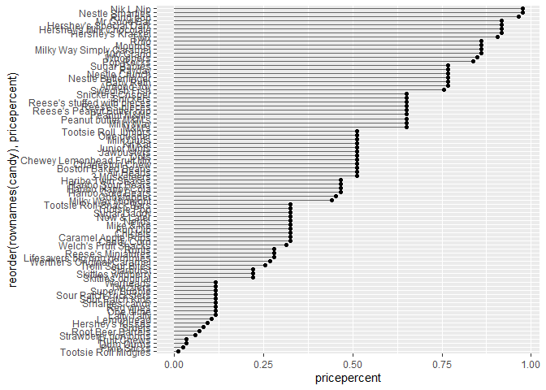
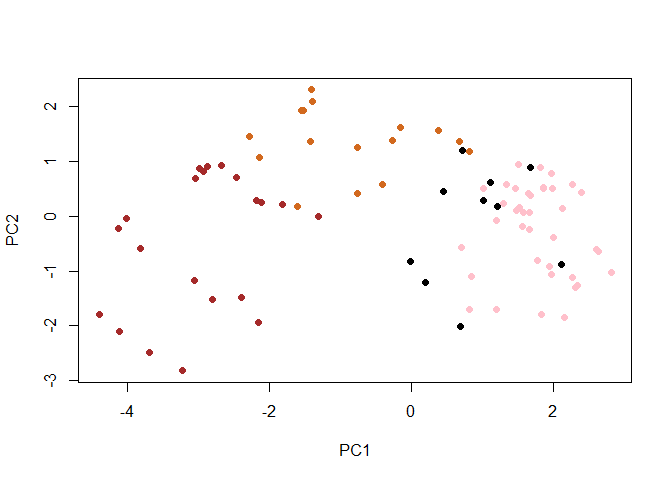
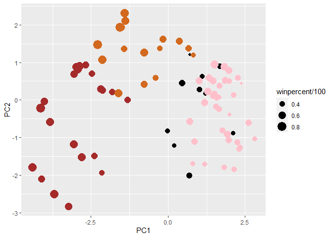

# Class 10: Halloween Mini-Project
Sarah Tareen

# 1. Importing candy data

Let’s get the data:

``` r
candy = read.csv('candy-data.csv', row.names=1)
head(candy)
```

                 chocolate fruity caramel peanutyalmondy nougat crispedricewafer
    100 Grand            1      0       1              0      0                1
    3 Musketeers         1      0       0              0      1                0
    One dime             0      0       0              0      0                0
    One quarter          0      0       0              0      0                0
    Air Heads            0      1       0              0      0                0
    Almond Joy           1      0       0              1      0                0
                 hard bar pluribus sugarpercent pricepercent winpercent
    100 Grand       0   1        0        0.732        0.860   66.97173
    3 Musketeers    0   1        0        0.604        0.511   67.60294
    One dime        0   0        0        0.011        0.116   32.26109
    One quarter     0   0        0        0.011        0.511   46.11650
    Air Heads       0   0        0        0.906        0.511   52.34146
    Almond Joy      0   1        0        0.465        0.767   50.34755

> **Q1**. How many different candy types are in this dataset?

``` r
nrow(candy)
```

    [1] 85

There are 85 candy types in the dataset.

> **Q2**. How many fruity candy types are in the dataset?

``` r
table(candy$fruity)
```


     0  1 
    47 38 

There are 38 fruity candy types.

# 2. What is your favorite candy?

> **Q3**. What is your favorite candy in the dataset and what is it’s
> `winpercent` value?

``` r
candy["Skittles original", ]$winpercent
```

    [1] 63.08514

The winpercent for Skittles original is 63.%

> **Q4**. What is the `winpercent` value for “Kit Kat”?

``` r
candy["Kit Kat", ]$winpercent
```

    [1] 76.7686

The winpercent for Kit Kat is 77%.

> **Q5**. What is the `winpercent` value for “Tootsie Roll Snack Bars”?

``` r
candy["Tootsie Roll Snack Bars", ]$winpercent
```

    [1] 49.6535

The winpercent for Tootsie Roll Snack Bars is 50%.

There is a helpful package for getting a brief overview of the dataset.

``` r
#install.packages("skimr")
library("skimr")
skim(candy)
```

|                                                  |       |
|:-------------------------------------------------|:------|
| Name                                             | candy |
| Number of rows                                   | 85    |
| Number of columns                                | 12    |
| \_\_\_\_\_\_\_\_\_\_\_\_\_\_\_\_\_\_\_\_\_\_\_   |       |
| Column type frequency:                           |       |
| numeric                                          | 12    |
| \_\_\_\_\_\_\_\_\_\_\_\_\_\_\_\_\_\_\_\_\_\_\_\_ |       |
| Group variables                                  | None  |

Data summary

**Variable type: numeric**

| skim_variable    | n_missing | complete_rate |  mean |    sd |    p0 |   p25 |   p50 |   p75 |  p100 | hist  |
|:-----------------|----------:|--------------:|------:|------:|------:|------:|------:|------:|------:|:------|
| chocolate        |         0 |             1 |  0.44 |  0.50 |  0.00 |  0.00 |  0.00 |  1.00 |  1.00 | ▇▁▁▁▆ |
| fruity           |         0 |             1 |  0.45 |  0.50 |  0.00 |  0.00 |  0.00 |  1.00 |  1.00 | ▇▁▁▁▆ |
| caramel          |         0 |             1 |  0.16 |  0.37 |  0.00 |  0.00 |  0.00 |  0.00 |  1.00 | ▇▁▁▁▂ |
| peanutyalmondy   |         0 |             1 |  0.16 |  0.37 |  0.00 |  0.00 |  0.00 |  0.00 |  1.00 | ▇▁▁▁▂ |
| nougat           |         0 |             1 |  0.08 |  0.28 |  0.00 |  0.00 |  0.00 |  0.00 |  1.00 | ▇▁▁▁▁ |
| crispedricewafer |         0 |             1 |  0.08 |  0.28 |  0.00 |  0.00 |  0.00 |  0.00 |  1.00 | ▇▁▁▁▁ |
| hard             |         0 |             1 |  0.18 |  0.38 |  0.00 |  0.00 |  0.00 |  0.00 |  1.00 | ▇▁▁▁▂ |
| bar              |         0 |             1 |  0.25 |  0.43 |  0.00 |  0.00 |  0.00 |  0.00 |  1.00 | ▇▁▁▁▂ |
| pluribus         |         0 |             1 |  0.52 |  0.50 |  0.00 |  0.00 |  1.00 |  1.00 |  1.00 | ▇▁▁▁▇ |
| sugarpercent     |         0 |             1 |  0.48 |  0.28 |  0.01 |  0.22 |  0.47 |  0.73 |  0.99 | ▇▇▇▇▆ |
| pricepercent     |         0 |             1 |  0.47 |  0.29 |  0.01 |  0.26 |  0.47 |  0.65 |  0.98 | ▇▇▇▇▆ |
| winpercent       |         0 |             1 | 50.32 | 14.71 | 22.45 | 39.14 | 47.83 | 59.86 | 84.18 | ▃▇▆▅▂ |

> - **Q6**. Is there any variable/column that looks to be on a different
>   scale to the majority of the other columns in the dataset?

Yes the columns n_missing and complete_rate are on the scale of only
ones and zeroes while the rest of the columns are between 0 and 1.

> - **Q7**. What do you think a zero and one represent for the
>   `candy$chocolate` column?

I believe a one means that the candy has chocolate in it and a zero
means it doesn’t.

Now we can do exploratory data analysis.

> **Q8**. Plot a histogram of `winpercent` values

``` r
hist(candy$winpercent)
```


> **Q9**. Is the distribution of `winpercent` values symmetrical?

No the distribution is not symmetrical because it is skewed more towards
the left and the median is below 50%.

> **Q10**. Is the center of the distribution above or below 50%?

``` r
mean(candy$winpercent)
```

    [1] 50.31676

The mean is slightly above 50%.

> **Q11**. On average is chocolate candy higher or lower ranked than
> fruit candy?

``` r
# We want to find the mean of the winpercents for a specific type of candy. We can make a subset of the winpercent column by turning the ones and zeroes into trues and falses. 

chocolate_candy = candy$winpercent[as.logical(candy$chocolate)]
mean(chocolate_candy)
```

    [1] 60.92153

``` r
fruity_candy = candy$winpercent[as.logical(candy$fruity)]
mean(fruity_candy)
```

    [1] 44.11974

Chocolate candy is ranked higher on average than fruity candy.

> **Q12**. Is this difference statistically significant?

``` r
# We are 95% confident that the difference between these two values is there. At minimum, we are confident they are 11% different and at the maximum they are 22% different. 
t.test(chocolate_candy, fruity_candy)
```


        Welch Two Sample t-test

    data:  chocolate_candy and fruity_candy
    t = 6.2582, df = 68.882, p-value = 2.871e-08
    alternative hypothesis: true difference in means is not equal to 0
    95 percent confidence interval:
     11.44563 22.15795
    sample estimates:
    mean of x mean of y 
     60.92153  44.11974 

Yes this difference is statistically significant because the t test has
a very low p-value of 2.871e-08.

We can also see this difference qualitatively using a boxplot.

``` r
boxplot(chocolate_candy, fruity_candy)
```


# 3. Overall Candy Rankings

> **Q13**. What are the five least liked candy types in this set?

``` r
head(candy[order(candy$winpercent),], n=5)
```

                       chocolate fruity caramel peanutyalmondy nougat
    Nik L Nip                  0      1       0              0      0
    Boston Baked Beans         0      0       0              1      0
    Chiclets                   0      1       0              0      0
    Super Bubble               0      1       0              0      0
    Jawbusters                 0      1       0              0      0
                       crispedricewafer hard bar pluribus sugarpercent pricepercent
    Nik L Nip                         0    0   0        1        0.197        0.976
    Boston Baked Beans                0    0   0        1        0.313        0.511
    Chiclets                          0    0   0        1        0.046        0.325
    Super Bubble                      0    0   0        0        0.162        0.116
    Jawbusters                        0    1   0        1        0.093        0.511
                       winpercent
    Nik L Nip            22.44534
    Boston Baked Beans   23.41782
    Chiclets             24.52499
    Super Bubble         27.30386
    Jawbusters           28.12744

The 5 least liked candy types are Nik L Nip, Boston Baked Beans,
Chiclets, Super Bubble, and Jawbusters.

> **Q14**. What are the top 5 all time favorite candy types out of this
> set?

``` r
head(candy[order(candy$winpercent, decreasing = TRUE),], n=5)
```

                              chocolate fruity caramel peanutyalmondy nougat
    Reese's Peanut Butter cup         1      0       0              1      0
    Reese's Miniatures                1      0       0              1      0
    Twix                              1      0       1              0      0
    Kit Kat                           1      0       0              0      0
    Snickers                          1      0       1              1      1
                              crispedricewafer hard bar pluribus sugarpercent
    Reese's Peanut Butter cup                0    0   0        0        0.720
    Reese's Miniatures                       0    0   0        0        0.034
    Twix                                     1    0   1        0        0.546
    Kit Kat                                  1    0   1        0        0.313
    Snickers                                 0    0   1        0        0.546
                              pricepercent winpercent
    Reese's Peanut Butter cup        0.651   84.18029
    Reese's Miniatures               0.279   81.86626
    Twix                             0.906   81.64291
    Kit Kat                          0.511   76.76860
    Snickers                         0.651   76.67378

The 5 all time favorite candy types are Reese’s Peanut Cups, Reese’s
Miniature Cups, Twix, Kit Kat, and Snickers.

> **Q15**. Make a first barplot of candy ranking based on `winpercent`
> values.

``` r
library(ggplot2)

ggplot(candy) + 
  aes(winpercent, rownames(candy)) +
  geom_col()
```


> **Q16**. This is quite ugly, use the `reorder()` function to get the
> bars sorted by `winpercent`?

``` r
ggplot(candy) + 
  aes(winpercent, reorder(rownames(candy), winpercent)) +
  geom_col()
```


Let’s add color:)

``` r
my_cols=rep("black", nrow(candy))
my_cols[as.logical(candy$chocolate)] = "chocolate"
my_cols[as.logical(candy$bar)] = "brown"
my_cols[as.logical(candy$fruity)] = "pink"
```

``` r
ggplot(candy) + 
  aes(winpercent, reorder(rownames(candy), winpercent)) +
  geom_col(fill=my_cols)
```


> **Q17**. What is the worst ranked chocolate candy?
>
> The worst ranked chocolate candy is Sixlets.
>
>   
> **Q18**. What is the best ranked fruity candy?
>
> The best ranked fruity candy is Starburst.

# 4. Taking a look at pricepercent

Let’s compare candy rank and price.

``` r
#add text labels that don't overlap
#install.packages("ggrepel")
library(ggrepel)

# How about a plot of price vs win
ggplot(candy) +
  aes(winpercent, pricepercent, label=rownames(candy)) +
  geom_point(col=my_cols) + 
  geom_text_repel(col=my_cols, size=3.3, max.overlaps = 5)
```

    Warning: ggrepel: 54 unlabeled data points (too many overlaps). Consider
    increasing max.overlaps


We can see which candy is most and least expensive by ordering the
columns.

> **Q19**. Which candy type is the highest ranked in terms of
> `winpercent` for the least money - i.e. offers the most bang for your
> buck?

Looking at the plot, we can see that Reese’s Miniatures are one of the
highest ranking candies (considering a winpercent of 80% is good) for
the least money.

> **Q20**. What are the top 5 most expensive candy types in the dataset
> and of these which is the least popular?

``` r
ord <- order(candy$pricepercent, decreasing = TRUE)
head( candy[ord,c(11,12)], n=5 )
```

                             pricepercent winpercent
    Nik L Nip                       0.976   22.44534
    Nestle Smarties                 0.976   37.88719
    Ring pop                        0.965   35.29076
    Hershey's Krackel               0.918   62.28448
    Hershey's Milk Chocolate        0.918   56.49050

The top 5 most expensive candy types are Nestle Smarties, Nik L Nip,
Ring Pop, Hershey’s Krackel, and Hershey’s Milk Chocolate. The least
popular one is Hershey’s Milk Chocolate.

Now let’s make a plot of pricepercent.

``` r
ggplot(candy) + 
  aes(pricepercent, reorder(rownames(candy), pricepercent)) +
  geom_col(fill=my_cols)
```


``` r
# Make a lollipop chart of pricepercent
ggplot(candy) +
  aes(pricepercent, reorder(rownames(candy), pricepercent)) +
  geom_segment(aes(yend = reorder(rownames(candy), pricepercent), 
                   xend = 0), col="gray40") +
    geom_point()
```



# 5. Exploring the correlation structure

``` r
#install.packages("corrplot")
library(corrplot)
```

    corrplot 0.92 loaded

``` r
cij <- cor(candy)
corrplot(cij)
```


> **Q22**. Examining this plot what two variables are anti-correlated
> (i.e. have minus values)?

Two variables that are anti-correlated are chocolate and fruity.

> **Q23**. Similarly, what two variables are most positively correlated?

Chocolate and bar are the most positively correlated candy types.

# 6. Principal Component Analysis

``` r
pca <- prcomp(candy, scale=TRUE)
summary(pca)
```

    Importance of components:
                              PC1    PC2    PC3     PC4    PC5     PC6     PC7
    Standard deviation     2.0788 1.1378 1.1092 1.07533 0.9518 0.81923 0.81530
    Proportion of Variance 0.3601 0.1079 0.1025 0.09636 0.0755 0.05593 0.05539
    Cumulative Proportion  0.3601 0.4680 0.5705 0.66688 0.7424 0.79830 0.85369
                               PC8     PC9    PC10    PC11    PC12
    Standard deviation     0.74530 0.67824 0.62349 0.43974 0.39760
    Proportion of Variance 0.04629 0.03833 0.03239 0.01611 0.01317
    Cumulative Proportion  0.89998 0.93832 0.97071 0.98683 1.00000

Let’s plot the first two components.

``` r
attributes(pca)
```

    $names
    [1] "sdev"     "rotation" "center"   "scale"    "x"       

    $class
    [1] "prcomp"

``` r
plot(pca$x[,1:2])
```


``` r
plot(pca$x[,1:2], col=my_cols, pch=16)
```



``` r
# Make a new data-frame with our PCA results and candy data
my_data <- cbind(candy, pca$x[,1:3])
```

``` r
p <- ggplot(my_data) + 
        aes(x=PC1, y=PC2, 
            size=winpercent/100,  
            text=rownames(my_data),
            label=rownames(my_data)) +
        geom_point(col=my_cols)
p
```


``` r
library(ggrepel)

p + geom_text_repel(size=3.3, col=my_cols, max.overlaps = 7)  + 
  theme(legend.position = "none") +
  labs(title="Halloween Candy PCA Space",
       subtitle="Colored by type: chocolate bar (dark brown), chocolate other (light brown), fruity (red), other (black)",
       caption="Data from 538")
```

    Warning: ggrepel: 43 unlabeled data points (too many overlaps). Consider
    increasing max.overlaps


``` r
p
```



``` r
#install.packages('plotly')
library(plotly)
```


    Attaching package: 'plotly'

    The following object is masked from 'package:ggplot2':

        last_plot

    The following object is masked from 'package:stats':

        filter

    The following object is masked from 'package:graphics':

        layout

``` r
#ggplotly(p)
#commented out because interactive plots won't render
```

.png)

``` r
#Let's check the loadings of the PCA.
par(mar=c(8,4,2,2))
barplot(pca$rotation[,1], las=2, ylab="PC1 Contribution")
```


> **Q24**. What original variables are picked up strongly by PC1 in the
> positive direction? Do these make sense to you?
>
> The variables fruity, hard, and pluribus are picked up strongly by PC1
> in the positive direction. This makes sense because I can think of
> multiple examples of candies that do have all or two of these
> attributes at the same time like Starburst and Skittles. So these
> variables are positively correlated.
