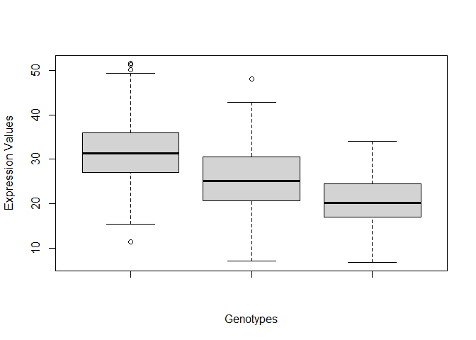

# Class 11 EC

# Section 4: Population Scale Analysis

> Q13: Read this file into R and determine the sample size for each
> genotype and their corresponding median expression levels for each of
> these genotypes.

``` r
table <- read.table("rs8067378_ENSG00000172057.6.txt")
```

``` r
graph <- boxplot(table$exp[table[,"geno"]=="A/A"], 
                 table$exp[table[,"geno"]=="A/G"], 
                 table$exp[table[,"geno"]=="G/G"], 
                 xlab = "Genotypes", ylab = "Expression Values")
```



``` r
graph
```

    $stats
             [,1]     [,2]     [,3]
    [1,] 15.42908  7.07505  6.67482
    [2,] 26.95022 20.62572 16.90256
    [3,] 31.24847 25.06486 20.07363
    [4,] 35.95503 30.55183 24.45672
    [5,] 49.39612 42.75662 33.95602

    $n
    [1] 108 233 121

    $conf
             [,1]     [,2]     [,3]
    [1,] 29.87942 24.03742 18.98858
    [2,] 32.61753 26.09230 21.15868

    $out
    [1] 51.51787 50.16704 51.30170 11.39643 48.03410

    $group
    [1] 1 1 1 1 2

    $names
    [1] "" "" ""

``` r
# The third row in the stats column of boxplot results are the medians of each genotype. 
graph$stats[3,]
```

    [1] 31.24847 25.06486 20.07363

The median expression level for A\|A genotype is 31.2, for A\|G is 25.1,
and for G\|G is 20.1.

``` r
# The n column tells you the observations of each boxplot.
graph$n
```

    [1] 108 233 121

The sample size for A\|A is 108, for A\|G is 233, and for G\|G is 121.

> Q14: Generate a boxplot with a box per genotype, what could you infer
> from the relative expression value between A/A and G/G displayed in
> this plot? Does the SNP effect the expression of ORMDL3?
>
> Looking at the boxplot from Q13 we can see that the expression of the
> gene ORMDL3 is lower in people with the G\|G genotype compared to the
> A\|A genotype because the G\|G group has a lower median and a
> distribution of expression values that are near or below the median of
> A\|A.

``` r
boxplot(table$exp[table[,"geno"]=="A/A"], 
        table$exp[table[,"geno"]=="A/G"], 
        table$exp[table[,"geno"]=="G/G"], 
        xlab = "Genotypes", ylab = "Expression Values")
```


