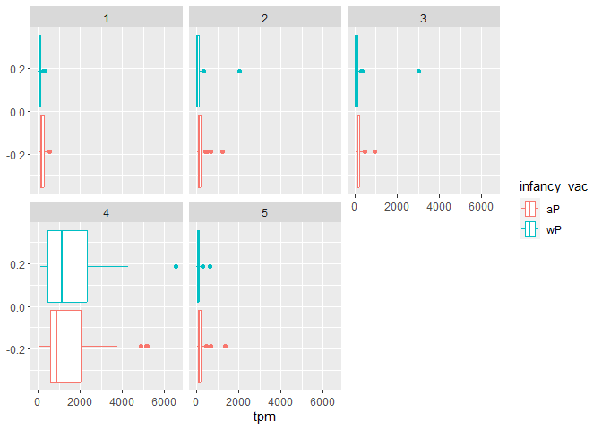

# Class19-Whooping_Cough
Sarah Tareen

# **1. Investigating pertussis cases by year**

``` r
library(ggplot2)
library(datapasta)
```

> **Q1.** With the help of the R “addin” package
> [**datapasta**](https://milesmcbain.github.io/datapasta/) assign the
> CDC pertussis case number data to a data frame called `cdc` and use
> **ggplot** to make a plot of cases numbers over time.

``` r
cdc <- data.frame(
                                 Year = c(1922L,1923L,1924L,1925L,
                                          1926L,1927L,1928L,1929L,1930L,1931L,
                                          1932L,1933L,1934L,1935L,1936L,
                                          1937L,1938L,1939L,1940L,1941L,1942L,
                                          1943L,1944L,1945L,1946L,1947L,
                                          1948L,1949L,1950L,1951L,1952L,
                                          1953L,1954L,1955L,1956L,1957L,1958L,
                                          1959L,1960L,1961L,1962L,1963L,
                                          1964L,1965L,1966L,1967L,1968L,1969L,
                                          1970L,1971L,1972L,1973L,1974L,
                                          1975L,1976L,1977L,1978L,1979L,1980L,
                                          1981L,1982L,1983L,1984L,1985L,
                                          1986L,1987L,1988L,1989L,1990L,
                                          1991L,1992L,1993L,1994L,1995L,1996L,
                                          1997L,1998L,1999L,2000L,2001L,
                                          2002L,2003L,2004L,2005L,2006L,2007L,
                                          2008L,2009L,2010L,2011L,2012L,
                                          2013L,2014L,2015L,2016L,2017L,2018L,
                                          2019L,2020L,2021L),
         No..Reported.Pertussis.Cases = c(107473,164191,165418,152003,
                                          202210,181411,161799,197371,
                                          166914,172559,215343,179135,265269,
                                          180518,147237,214652,227319,103188,
                                          183866,222202,191383,191890,109873,
                                          133792,109860,156517,74715,69479,
                                          120718,68687,45030,37129,60886,
                                          62786,31732,28295,32148,40005,
                                          14809,11468,17749,17135,13005,6799,
                                          7717,9718,4810,3285,4249,3036,
                                          3287,1759,2402,1738,1010,2177,2063,
                                          1623,1730,1248,1895,2463,2276,
                                          3589,4195,2823,3450,4157,4570,
                                          2719,4083,6586,4617,5137,7796,6564,
                                          7405,7298,7867,7580,9771,11647,
                                          25827,25616,15632,10454,13278,
                                          16858,27550,18719,48277,28639,32971,
                                          20762,17972,18975,15609,18617,
                                          6124,2116)
       )
```

``` r
ggplot(cdc) + aes(x = Year, No..Reported.Pertussis.Cases) +
  geom_point() +
  geom_line() +
  labs(title="Pertussis Cases by Year (1922-2021)") +
  xlab("Year") +
  ylab("Number of cases")
```


# **2. A tale of two vaccines (wP & aP)**

> **Q2.** Using the ggplot `geom_vline()` function add lines to your
> previous plot for the 1946 introduction of the wP vaccine and the 1996
> switch to aP vaccine (see example in the hint below). What do you
> notice?

``` r
ggplot(cdc) + aes(x = Year, No..Reported.Pertussis.Cases) +
  geom_point() +
  geom_line() +
  # lines represent the two vaccines
  geom_vline(xintercept = 1946, col = "blue") +
  geom_vline(xintercept = 1996, col = "red") +
  geom_text(x=1946, y = 250000, label = "wP") +
  geom_text(x=1996, y=250000, label = "aP") +
    labs(title="Pertussis Cases by Year (1922-2021)") +
  xlab("Year") +
  ylab("Number of cases")
```


I noticed that the cases decreased at a rapid rate after the first
vaccine wP was introduced and the cases were at a low baseline level.
However, a couple years after the aP vaccine was introduced, the number
of cases rose and fell.

> **Q3.** Describe what happened after the introduction of the aP
> vaccine? Do you have a possible explanation for the observed trend?

The number of cases rose a couple years after the aP vaccine was
introduced. I am predicting this may be due to a mutation in the
whooping cough bacteria that is causing the new aP vaccine to not be as
effective.

Other reasons could be more advanced testing, less people getting
vaccinated, and decreasing immunity in people who got the aP vaccine as
a baby that may be quicker than people who got the wP vaccine.

# **3. Exploring CMI-PB data**

``` r
#This package allows us to work with JSON format data
library(jsonlite)
```

``` r
subject <- read_json("https://www.cmi-pb.org/api/subject", 
                     simplifyVector = TRUE) 
```

``` r
head(subject)
```

      subject_id infancy_vac biological_sex              ethnicity  race
    1          1          wP         Female Not Hispanic or Latino White
    2          2          wP         Female Not Hispanic or Latino White
    3          3          wP         Female                Unknown White
    4          4          wP           Male Not Hispanic or Latino Asian
    5          5          wP           Male Not Hispanic or Latino Asian
    6          6          wP         Female Not Hispanic or Latino White
      year_of_birth date_of_boost      dataset
    1    1986-01-01    2016-09-12 2020_dataset
    2    1968-01-01    2019-01-28 2020_dataset
    3    1983-01-01    2016-10-10 2020_dataset
    4    1988-01-01    2016-08-29 2020_dataset
    5    1991-01-01    2016-08-29 2020_dataset
    6    1988-01-01    2016-10-10 2020_dataset

> **Q4.** How many aP and wP infancy vaccinated subjects are in the
> dataset?

``` r
table(subject$infancy_vac)
```


    aP wP 
    47 49 

There are 47 aP and 49 wP infancy vaccinated subjects in the dataset.

> **Q5.** How many Male and Female subjects/patients are in the dataset?

``` r
table(subject$biological_sex)
```


    Female   Male 
        66     30 

There are 66 females and 30 males.

> **Q6.** What is the breakdown of race and biological sex (e.g. number
> of Asian females, White males etc…)?

``` r
table(subject$race, subject$biological_sex)
```

                                               
                                                Female Male
      American Indian/Alaska Native                  0    1
      Asian                                         18    9
      Black or African American                      2    0
      More Than One Race                             8    2
      Native Hawaiian or Other Pacific Islander      1    1
      Unknown or Not Reported                       10    4
      White                                         27   13

The breakdown is shown above in the table.

## **Side-Note: Working with dates**

``` r
library(lubridate)
```


    Attaching package: 'lubridate'

    The following objects are masked from 'package:base':

        date, intersect, setdiff, union

``` r
# Today's date
today()
```

    [1] "2023-06-12"

``` r
# How many days have passed since new year 2000
today() - ymd("2000-01-01")
```

    Time difference of 8563 days

We are using the `ymd()` function to tell lubridate the format of our
particular date and then the `time_length()` function to convert days to
years.

``` r
# What is this in years?
time_length( today() - ymd("2000-01-01"),  "years")
```

    [1] 23.44422

> **Q7.** Using this approach determine (i) the average age of wP
> individuals, (ii) the average age of aP individuals; and (iii) are
> they significantly different?

``` r
# Use todays date to calculate age in days
subject$age <- today() - ymd(subject$year_of_birth)
subject$age
```

    Time differences in days
     [1] 13676 20251 14772 12946 11850 12946 15502 14041 10024 15137 13676 15137
    [13]  9658 11119 12580 13311 15868  9658 10754 13311 11119 10389 11119 12215
    [25] 17329 18790 18790 12215  9293  9293 11850 10389 10389  9293  9293 12946
    [37] 11119 13311 11485 11119  9293  8928  9658  8563  9293  8563  8563  9658
    [49]  8928  9293  8563 10024  8928  9293  8563 15502 14772 14041 11850 11485
    [61] 12946 14772  9658 15137  9658 12946 12580  9658 12215 14772 11850  9658
    [73]  9293  9658 14041 10754 14041  9658  9293  9293  9658  9293 10024  9293
    [85]  9658  9658  9658  9293  9293  9658  9658  9658 10024  9658  9658  9658

``` r
library(dplyr)
```


    Attaching package: 'dplyr'

    The following objects are masked from 'package:stats':

        filter, lag

    The following objects are masked from 'package:base':

        intersect, setdiff, setequal, union

``` r
# filter by vaccine
wp <- subject %>% filter(infancy_vac == "wP")

round( summary( time_length(wp$age, "years" ) ) )
```

       Min. 1st Qu.  Median    Mean 3rd Qu.    Max. 
         28      32      35      37      40      55 

\(i\) The average age of wP individuals is 37 years.

``` r
ap <- subject %>% filter(infancy_vac == "aP")

round( summary( time_length( ap$age, "years" ) ) )
```

       Min. 1st Qu.  Median    Mean 3rd Qu.    Max. 
         23      25      26      26      26      27 

\(ii\) The average age of aP individuals is 26 years.

\(iii\) Yes the ages are statistically different from each other.

> **Q8.** Determine the age of all individuals at time of boost?

``` r
int <- ymd(subject$date_of_boost) - ymd(subject$year_of_birth)
age_at_boost <- time_length(int, "year")
head(age_at_boost)
```

    [1] 30.69678 51.07461 33.77413 28.65982 25.65914 28.77481

The ages of all individuals at the time of boost are in the table above
which is showing the first 6 individuals.

> **Q9.** With the help of a faceted boxplot or histogram (see below),
> do you think these two groups are significantly different?

``` r
ggplot(subject) +
  aes(time_length(age, "year"),
      fill=as.factor(infancy_vac)) +
  geom_histogram(show.legend=FALSE) +
  facet_wrap(vars(infancy_vac), nrow=2) +
  xlab("Age in years")
```

    `stat_bin()` using `bins = 30`. Pick better value with `binwidth`.


Yes these groups are significantly different because the majority of
people who got the wP vaccine are older than the people who got the aP
vaccine, which makes sense since the aP vaccine was introduced later.
There is also a much larger spread in the ages of people who got the wP
vaccine, which also makes sense since it was around for a longer time
period.

We can also see this using a p-value which is very small.

``` r
# Or use wilcox.test() 
x <- t.test(time_length( wp$age, "years" ),
       time_length( ap$age, "years" ))

x$p.value
```

    [1] 1.316045e-16

## **Joining multiple tables**

Let’s read in the data from the JSON files.

``` r
# Complete the API URLs...
specimen <- read_json("https://www.cmi-pb.org/api//specimen", simplifyVector = TRUE) 
titer <- read_json("https://www.cmi-pb.org/api/ab_titer", simplifyVector = TRUE) 
```

We need to join data frames to tell which vaccine the specimen_id got.

> **Q10.** Complete the code to join `specimen` and `subject` tables to
> make a new merged data frame containing all specimen records along
> with their associated subject details:

``` r
# Use dplyr function to join 
meta <- inner_join(specimen, subject)
```

    Joining with `by = join_by(subject_id)`

``` r
dim(meta)
```

    [1] 729  14

``` r
head(meta)
```

      specimen_id subject_id actual_day_relative_to_boost
    1           1          1                           -3
    2           2          1                          736
    3           3          1                            1
    4           4          1                            3
    5           5          1                            7
    6           6          1                           11
      planned_day_relative_to_boost specimen_type visit infancy_vac biological_sex
    1                             0         Blood     1          wP         Female
    2                           736         Blood    10          wP         Female
    3                             1         Blood     2          wP         Female
    4                             3         Blood     3          wP         Female
    5                             7         Blood     4          wP         Female
    6                            14         Blood     5          wP         Female
                   ethnicity  race year_of_birth date_of_boost      dataset
    1 Not Hispanic or Latino White    1986-01-01    2016-09-12 2020_dataset
    2 Not Hispanic or Latino White    1986-01-01    2016-09-12 2020_dataset
    3 Not Hispanic or Latino White    1986-01-01    2016-09-12 2020_dataset
    4 Not Hispanic or Latino White    1986-01-01    2016-09-12 2020_dataset
    5 Not Hispanic or Latino White    1986-01-01    2016-09-12 2020_dataset
    6 Not Hispanic or Latino White    1986-01-01    2016-09-12 2020_dataset
             age
    1 13676 days
    2 13676 days
    3 13676 days
    4 13676 days
    5 13676 days
    6 13676 days

> **Q11.** Now using the same procedure join `meta` with `titer` data so
> we can further analyze this data in terms of time of visit aP/wP,
> male/female etc.

``` r
abdata <- inner_join(titer, meta)
```

    Joining with `by = join_by(specimen_id)`

``` r
dim(abdata)
```

    [1] 32675    21

> **Q12.** How many specimens (i.e. entries in `abdata`) do we have for
> each `isotype`?

``` r
table(abdata$isotype)
```


     IgE  IgG IgG1 IgG2 IgG3 IgG4 
    6698 1413 6141 6141 6141 6141 

> **Q13.** What do you notice about the number of visit 8 specimens
> compared to other visits?

``` r
table(abdata$visit)
```


       1    2    3    4    5    6    7    8 
    5795 4640 4640 4640 4640 4320 3920   80 

Visits 1-7 have greater than 3000 results but visit 8 only has 80. This
is because visit 8 is the most recent data so it is still getting
updated.

# **4. Examine IgG1 Ab titer levels**

Now we can filter our new dataframe to only have the IgG1 isotype, and
take out the outlier visit 8.

``` r
ig1 <- abdata %>% filter(isotype == "IgG1", visit!=8)
head(ig1)
```

      specimen_id isotype is_antigen_specific antigen        MFI MFI_normalised
    1           1    IgG1                TRUE     ACT 274.355068      0.6928058
    2           1    IgG1                TRUE     LOS  10.974026      2.1645083
    3           1    IgG1                TRUE   FELD1   1.448796      0.8080941
    4           1    IgG1                TRUE   BETV1   0.100000      1.0000000
    5           1    IgG1                TRUE   LOLP1   0.100000      1.0000000
    6           1    IgG1                TRUE Measles  36.277417      1.6638332
       unit lower_limit_of_detection subject_id actual_day_relative_to_boost
    1 IU/ML                 3.848750          1                           -3
    2 IU/ML                 4.357917          1                           -3
    3 IU/ML                 2.699944          1                           -3
    4 IU/ML                 1.734784          1                           -3
    5 IU/ML                 2.550606          1                           -3
    6 IU/ML                 4.438966          1                           -3
      planned_day_relative_to_boost specimen_type visit infancy_vac biological_sex
    1                             0         Blood     1          wP         Female
    2                             0         Blood     1          wP         Female
    3                             0         Blood     1          wP         Female
    4                             0         Blood     1          wP         Female
    5                             0         Blood     1          wP         Female
    6                             0         Blood     1          wP         Female
                   ethnicity  race year_of_birth date_of_boost      dataset
    1 Not Hispanic or Latino White    1986-01-01    2016-09-12 2020_dataset
    2 Not Hispanic or Latino White    1986-01-01    2016-09-12 2020_dataset
    3 Not Hispanic or Latino White    1986-01-01    2016-09-12 2020_dataset
    4 Not Hispanic or Latino White    1986-01-01    2016-09-12 2020_dataset
    5 Not Hispanic or Latino White    1986-01-01    2016-09-12 2020_dataset
    6 Not Hispanic or Latino White    1986-01-01    2016-09-12 2020_dataset
             age
    1 13676 days
    2 13676 days
    3 13676 days
    4 13676 days
    5 13676 days
    6 13676 days

> **Q14.** Complete the following code to make a summary boxplot of Ab
> titer levels (MFI) for all antigens:

``` r
ggplot(ig1) +
  # MFI is how much antibody titer data there is
  aes(MFI, antigen) +
  geom_boxplot() + 
  facet_wrap(vars(visit), nrow=2)
```


> **Q15.** What antigens show differences in the level of IgG1 antibody
> titers recognizing them over time? Why these and not others?

The FIM2/3 antigen is increasing over time while the other anitgens stay
pretty constant over the 7 visits shown. This antigen is related to
whooping cough as it matches the proteins that are used by B. pertussis
to attach to substrates.

Try to see the difference between the two types of vaccines in the plot.
This is kind of hard to see.

``` r
ggplot(ig1) +
  aes(MFI, antigen, col=infancy_vac ) +
  geom_boxplot(show.legend = FALSE) + 
  facet_wrap(vars(visit), nrow=2) +
  theme_bw()
```


Another version of the graph:

``` r
ggplot(ig1) +
  aes(MFI, antigen, col=infancy_vac ) +
  geom_boxplot(show.legend = FALSE) + 
  facet_wrap(vars(infancy_vac, visit), nrow=2)
```


> **Q16.** Filter to pull out only two specific antigens for analysis
> and create a boxplot for each. You can chose any you like. Below I
> picked a “control” antigen (**“Measles”**, that is not in our
> vaccines) and a clear antigen of interest (**“FIM2/3”**,
> extra-cellular fimbriae proteins from *B. pertussis* that participate
> in substrate attachment).
>
> I picked “FIM2/3” and “TT” as my antigens.

``` r
filter(ig1, antigen=="FIM2/3") %>%
  ggplot() +
  aes(MFI, col=infancy_vac) +
  geom_boxplot(show.legend = FALSE) +
  facet_wrap(vars(visit)) +
  theme_bw()
```


``` r
filter(ig1, antigen=="Measles") %>%
  ggplot() +
  aes(MFI, col=infancy_vac) +
  geom_boxplot(show.legend = FALSE) +
  facet_wrap(vars(visit)) +
  theme_bw()
```


> **Q17.** What do you notice about these two antigens time courses and
> the FIM2/3 data in particular?
>
> We can see that FIM2/3 antigen significantly increased by Visit 5 and
> then slowly decrease, but the levels for Measles remained relatively
> constant.
>
> **Q18.** Do you see any clear difference in aP vs. wP responses?
>
> There are no significant differences between the two vaccine types in
> the amount of anitgen types above, however, there is slightly more
> differences in the FIM2/3 antigen compared to the Measles one.

# **5. Obtaining CMI-PB RNASeq data**

``` r
url <- "https://www.cmi-pb.org/api/v2/rnaseq?versioned_ensembl_gene_id=eq.ENSG00000211896.7"

rna <- read_json(url, simplifyVector = TRUE) 
```

``` r
#meta <- inner_join(specimen, subject)
ssrna <- inner_join(rna, meta)
```

    Joining with `by = join_by(specimen_id)`

> **Q19.** Make a plot of the time course of gene expression for IGHG1
> gene (i.e. a plot of `visit` vs. `tpm`).

``` r
ggplot(ssrna) +
  aes(visit, tpm, group=subject_id) +
  geom_point() +
  geom_line(alpha=0.2)
```


> **Q20.**: What do you notice about the expression of this gene
> (i.e. when is it at it’s maximum level)?

The expression of the gene is at its maximum level at Visit 4. It
increases up to Visit 4 then sharply drops.

> **Q21.** Does this pattern in time match the trend of antibody titer
> data? If not, why not?

Yes because we saw that the antibody FIM2/3 increased around Visit 4
which related to the high expression of the gene.

Let’s compare by vaccine type:

``` r
ggplot(ssrna) +
  aes(tpm, col=infancy_vac) +
  geom_boxplot() +
  facet_wrap(vars(visit))
```



``` r
ssrna %>%  
  filter(visit==4) %>% 
  ggplot() +
    aes(tpm, col=infancy_vac) + geom_density() + 
    geom_rug() 
```


We can see that there is not much significant difference between the two
vaccine types.
