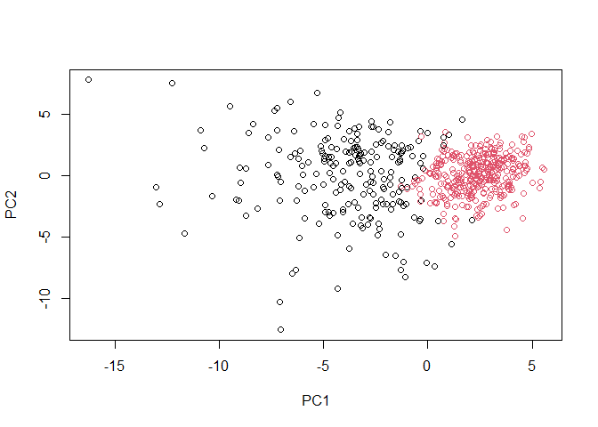

# Lab8_mini_project
Sarah Tareen

# 1. Exploratory Data Analysis

## Preparing the Data

Let’s load the data from the breast mass samples:

``` r
# Save your input data file into your Project directory
fna.data <- "WisconsinCancer.csv"

# Complete the following code to input the data and store as wisc.df
wisc.df <- read.csv(fna.data, row.names=1)
```

We can remove the diagnosis from the data frame because that gives us
the answers.

``` r
wisc.data <- wisc.df[,-1]
```

Let’s save the diagnosis column as a vector that will be useful for
plotting later.

``` r
diagnosis <- wisc.df[,1]
```

## Exploratory data analysis

\>**Q1**. How many observations are in this dataset?

``` r
nrow(wisc.data)
```

    [1] 569

There are 569 observations in this dataset, represented by the rows.

\>**Q2**. How many of the observations have a malignant diagnosis?

``` r
table(diagnosis)
```

    diagnosis
      B   M 
    357 212 

There are 212 malignant observations.

\>Q3. How many variables/features in the data are suffixed with `_mean`?

``` r
#the numbers are the column numbers with the substring
grep("_mean", colnames(wisc.data))
```

     [1]  1  2  3  4  5  6  7  8  9 10

There are 10 variables (columns) that are suffixed with `_mean`.

# 2. Principal Component Analysis

## Performing PCA

Check if you need to scale the data.

``` r
# Check column means and standard deviations
colMeans(wisc.data)
```

                radius_mean            texture_mean          perimeter_mean 
               1.412729e+01            1.928965e+01            9.196903e+01 
                  area_mean         smoothness_mean        compactness_mean 
               6.548891e+02            9.636028e-02            1.043410e-01 
             concavity_mean     concave.points_mean           symmetry_mean 
               8.879932e-02            4.891915e-02            1.811619e-01 
     fractal_dimension_mean               radius_se              texture_se 
               6.279761e-02            4.051721e-01            1.216853e+00 
               perimeter_se                 area_se           smoothness_se 
               2.866059e+00            4.033708e+01            7.040979e-03 
             compactness_se            concavity_se       concave.points_se 
               2.547814e-02            3.189372e-02            1.179614e-02 
                symmetry_se    fractal_dimension_se            radius_worst 
               2.054230e-02            3.794904e-03            1.626919e+01 
              texture_worst         perimeter_worst              area_worst 
               2.567722e+01            1.072612e+02            8.805831e+02 
           smoothness_worst       compactness_worst         concavity_worst 
               1.323686e-01            2.542650e-01            2.721885e-01 
       concave.points_worst          symmetry_worst fractal_dimension_worst 
               1.146062e-01            2.900756e-01            8.394582e-02 

``` r
apply(wisc.data,2,sd)
```

                radius_mean            texture_mean          perimeter_mean 
               3.524049e+00            4.301036e+00            2.429898e+01 
                  area_mean         smoothness_mean        compactness_mean 
               3.519141e+02            1.406413e-02            5.281276e-02 
             concavity_mean     concave.points_mean           symmetry_mean 
               7.971981e-02            3.880284e-02            2.741428e-02 
     fractal_dimension_mean               radius_se              texture_se 
               7.060363e-03            2.773127e-01            5.516484e-01 
               perimeter_se                 area_se           smoothness_se 
               2.021855e+00            4.549101e+01            3.002518e-03 
             compactness_se            concavity_se       concave.points_se 
               1.790818e-02            3.018606e-02            6.170285e-03 
                symmetry_se    fractal_dimension_se            radius_worst 
               8.266372e-03            2.646071e-03            4.833242e+00 
              texture_worst         perimeter_worst              area_worst 
               6.146258e+00            3.360254e+01            5.693570e+02 
           smoothness_worst       compactness_worst         concavity_worst 
               2.283243e-02            1.573365e-01            2.086243e-01 
       concave.points_worst          symmetry_worst fractal_dimension_worst 
               6.573234e-02            6.186747e-02            1.806127e-02 

Let’s do PCA analysis using the `prcomp()` function.

``` r
# Perform PCA on wisc.data by completing the following code
wisc.pr <- prcomp(wisc.data, scale = TRUE)
```

Let’s see a summary of the PCA analysis.

``` r
# Look at summary of results
summary(wisc.pr)
```

    Importance of components:
                              PC1    PC2     PC3     PC4     PC5     PC6     PC7
    Standard deviation     3.6444 2.3857 1.67867 1.40735 1.28403 1.09880 0.82172
    Proportion of Variance 0.4427 0.1897 0.09393 0.06602 0.05496 0.04025 0.02251
    Cumulative Proportion  0.4427 0.6324 0.72636 0.79239 0.84734 0.88759 0.91010
                               PC8    PC9    PC10   PC11    PC12    PC13    PC14
    Standard deviation     0.69037 0.6457 0.59219 0.5421 0.51104 0.49128 0.39624
    Proportion of Variance 0.01589 0.0139 0.01169 0.0098 0.00871 0.00805 0.00523
    Cumulative Proportion  0.92598 0.9399 0.95157 0.9614 0.97007 0.97812 0.98335
                              PC15    PC16    PC17    PC18    PC19    PC20   PC21
    Standard deviation     0.30681 0.28260 0.24372 0.22939 0.22244 0.17652 0.1731
    Proportion of Variance 0.00314 0.00266 0.00198 0.00175 0.00165 0.00104 0.0010
    Cumulative Proportion  0.98649 0.98915 0.99113 0.99288 0.99453 0.99557 0.9966
                              PC22    PC23   PC24    PC25    PC26    PC27    PC28
    Standard deviation     0.16565 0.15602 0.1344 0.12442 0.09043 0.08307 0.03987
    Proportion of Variance 0.00091 0.00081 0.0006 0.00052 0.00027 0.00023 0.00005
    Cumulative Proportion  0.99749 0.99830 0.9989 0.99942 0.99969 0.99992 0.99997
                              PC29    PC30
    Standard deviation     0.02736 0.01153
    Proportion of Variance 0.00002 0.00000
    Cumulative Proportion  1.00000 1.00000

\>Q4. From your results, what proportion of the original variance is
captured by the first principal components (PC1)?

We can see from the summary in the proportion of variance that PC1 has
0.4427 proportion of original variance of the data set.

\>Q5. How many principal components (PCs) are required to describe at
least 70% of the original variance in the data?

By looking at the PCA summary, we can look at the cumulative proportions
and we see that PC1 to 3 cumulatively makes up 72.636% of the total
variance. Therefore, we need the first three PCs to get at least 70% of
the original variance in the data.

\>Q6. How many principal components (PCs) are required to describe at
least 90% of the original variance in the data?

Looking at the summary, we see that PC1 to 7 make up 91.01% of the total
variance.

## Interpreting PCA Results

Let’s visualize the PCA analysis using a `biplot`.

``` r
biplot(wisc.pr)
```


\>Q7. What stands out to you about this plot? Is it easy or difficult to
understand? Why?

This plot has the column names and sample numbers all in the same graph.
The column names seem to all be connected in the middle. There are also
additional axes on the right and the top which are unlabeled. This plot
is very difficult to understand as there is so much text all centered in
a small space which makes it impossible to see all the data at once.

This plot is very bad so lets make another type of plot.

``` r
# Scatter plot observations by components 1 and 2
fdiag <- as.factor(diagnosis)
plot(wisc.pr$x[,1], wisc.pr$x[,2], col = fdiag, xlab = "PC1", ylab = "PC2")
```


\>Q8. Generate a similar plot for principal components 1 and 3. What do
you notice about these plots?

``` r
# Scatter plot observations by components 1 and 3
plot(wisc.pr$x[,1], wisc.pr$x[,3], col = fdiag, xlab = "PC1", ylab = "PC3")
```


I noticed that the there is an axis for each PC and it is much easier to
tell which samples are more closely related. You can also easily tell
what the outlier samples are.

In the plot above, we can see that PC1 is differentiating between the
malignant and benign samples.

### ggplot2

Let’s use `ggplot2` to make even better plots. First we need to change
our PCA analysis to a data frame and add the diagnosis column to used
for the color aesthetic.

``` r
# Create a data.frame for ggplot
df <- as.data.frame(wisc.pr$x)
df$diagnosis <- diagnosis
```

Now we can make the plot.

``` r
# Load the ggplot2 package
library(ggplot2)

# Make a scatter plot colored by diagnosis
ggplot(df) + 
  aes(PC1, PC2, col=diagnosis) + 
  geom_point()
```


## Variance Explained

We can look at more plots that show the variance of each PC. First we
can look at variance of each principal component.

``` r
pr.var <- wisc.pr$sdev^2
head(pr.var)
```

    [1] 13.281608  5.691355  2.817949  1.980640  1.648731  1.207357

``` r
pve <- pr.var/sum(pr.var)
```

Now we can create the scree plot.

``` r
# Plot variance explained for each principal component
plot(pve, xlab = "Principal Component", 
     ylab = "Proportion of Variance Explained", 
     ylim = c(0, 1), type = "o")
```


We can also make a barplot from the same data.

``` r
# Alternative scree plot of the same data, note data driven y-axis
barplot(pve, ylab = "Precent of Variance Explained",
     names.arg=paste0("PC",1:length(pve)), las=2, axes = FALSE)
axis(2, at=pve, labels=round(pve,2)*100 )
```


\>Q9. For the first principal component, what is the component of the
loading vector (i.e. `wisc.pr$rotation[,1]`) for the feature
`concave.points_mean`? This tells us how much this original feature
contributes to the first PC.

``` r
sort(wisc.pr$rotation[,1])
```

        concave.points_mean          concavity_mean    concave.points_worst 
                -0.26085376             -0.25840048             -0.25088597 
           compactness_mean         perimeter_worst         concavity_worst 
                -0.23928535             -0.23663968             -0.22876753 
               radius_worst          perimeter_mean              area_worst 
                -0.22799663             -0.22753729             -0.22487053 
                  area_mean             radius_mean            perimeter_se 
                -0.22099499             -0.21890244             -0.21132592 
          compactness_worst               radius_se                 area_se 
                -0.21009588             -0.20597878             -0.20286964 
          concave.points_se          compactness_se            concavity_se 
                -0.18341740             -0.17039345             -0.15358979 
            smoothness_mean           symmetry_mean fractal_dimension_worst 
                -0.14258969             -0.13816696             -0.13178394 
           smoothness_worst          symmetry_worst           texture_worst 
                -0.12795256             -0.12290456             -0.10446933 
               texture_mean    fractal_dimension_se  fractal_dimension_mean 
                -0.10372458             -0.10256832             -0.06436335 
                symmetry_se              texture_se           smoothness_se 
                -0.04249842             -0.01742803             -0.01453145 

The concave.points_mean is the most important for PC1 and its component
in the variance of PC1 is -0.26085376.

# 3. Hierarchical clustering

``` r
# Scale the wisc.data data using the "scale()" function
data.scaled <- scale(wisc.data)
```

``` r
data.dist <- dist(data.scaled)
```

``` r
wisc.hclust <- hclust(data.dist, method = "complete")
wisc.hclust
```


    Call:
    hclust(d = data.dist, method = "complete")

    Cluster method   : complete 
    Distance         : euclidean 
    Number of objects: 569 

\>**Q10.** Using the `plot()` and `abline()` functions, what is the
height at which the clustering model has 4 clusters?

``` r
plot(wisc.hclust)
abline(wisc.hclust, col="red", lty=2, h=18)
```


The height at which the clustering model has 4 clusters is 18.

We can use `cutree()` so that our tree has 4 clusters.

``` r
wisc.hclust.clusters <- cutree(wisc.hclust, k=4)
plot(wisc.hclust.clusters)
```


Lets compare the assigned clusters to the actual diagnoses.

``` r
# we can see that cluster 1 corresponds to malignant cells while cluster 3 corresponds to benign cells
table(wisc.hclust.clusters, diagnosis)
```

                        diagnosis
    wisc.hclust.clusters   B   M
                       1  12 165
                       2   2   5
                       3 343  40
                       4   0   2

## Using different methods

We can use different methods of combining points in `hclust`.

``` r
# this first plot is using "complete" as default
plot(wisc.hclust)
```


``` r
wisc.hclust.s <- hclust(data.dist, method = "single")
plot(wisc.hclust.s)
```


``` r
wisc.hclust.a <- hclust(data.dist, method = "average")
plot(wisc.hclust.a)
```


``` r
wisc.hclust.w <- hclust(data.dist, method = "ward.D2")
plot(wisc.hclust.w)
```


\>Q12. Which method gives your favorite results for the same `data.dist`
dataset? Explain your reasoning.

I liked the `ward.D2` method because I can see the clusters more easily
and it looks less messy.

# 4. Combining methods

## Clustering on PCA results

We want to see if PCA will improve `hclust` clustering.

``` r
pca.dist = dist(wisc.pr$x[, 1:7])
wisc.pr.hclust = hclust(pca.dist, method="ward.D2")
plot(wisc.pr.hclust)
```


Let’s see if the two main branches of this dendrogram are indicating the
diagnoses.

``` r
grps <- cutree(wisc.pr.hclust, k=2)
table(grps)
```

    grps
      1   2 
    216 353 

``` r
table(grps, diagnosis)
```

        diagnosis
    grps   B   M
       1  28 188
       2 329  24

``` r
plot(wisc.pr$x[,1:2], col=grps)
```



``` r
plot(wisc.pr$x[,1:2], col=fdiag)
```


Let’s use the distance along the first 7 PCs for clustering.

``` r
pca.dist.7 = dist(wisc.pr$x[, 1:7])
wisc.pr.hclust.7 = hclust(pca.dist.7, method="ward.D2")
plot(wisc.pr.hclust.7)
```


``` r
wisc.pr.hclust.clusters <- cutree(wisc.pr.hclust, k=2)
plot(wisc.pr.hclust.clusters)
```


Now let’s compare our model to the actual diagnoses.

\>Q13. How well does the newly created model with four clusters separate
out the two diagnoses?

``` r
table(wisc.pr.hclust.clusters, diagnosis)
```

                           diagnosis
    wisc.pr.hclust.clusters   B   M
                          1  28 188
                          2 329  24

\>Q14. How well do the hierarchical clustering models you created in
previous sections (i.e. before PCA) do in terms of separating the
diagnoses? Again, use the `table()` function to compare the output of
each model (`wisc.km$cluster` and `wisc.hclust.clusters`) with the
vector containing the actual diagnoses.

``` r
table(wisc.hclust.clusters, diagnosis)
```

                        diagnosis
    wisc.hclust.clusters   B   M
                       1  12 165
                       2   2   5
                       3 343  40
                       4   0   2

I believe that when we combined the PCA and hierarchical clustering
models together this model did a better job at distinguishing the
malignant samples since there is a higher number of malignant samples in
cluster 1 of `wisc.pr.hclust.clusters` than `wisc.hclust.clusters`.
However I believe the `hclust` model that separated the data into 4
clusters did a better job at distinguishing the number of benign
samples. Overall the PCA and `hclust` model is more intuitive since we
cut the tree into 2 clusters and it is easier to tell which cluster
correlates with which diagnosis.

# 6. Prediction

We can compare old and new cancer cell data by using our PCA model to
predict.

``` r
url <- "https://tinyurl.com/new-samples-CSV"
new <- read.csv(url)
npc <- predict(wisc.pr, newdata=new)
npc
```

               PC1       PC2        PC3        PC4       PC5        PC6        PC7
    [1,]  2.576616 -3.135913  1.3990492 -0.7631950  2.781648 -0.8150185 -0.3959098
    [2,] -4.754928 -3.009033 -0.1660946 -0.6052952 -1.140698 -1.2189945  0.8193031
                PC8       PC9       PC10      PC11      PC12      PC13     PC14
    [1,] -0.2307350 0.1029569 -0.9272861 0.3411457  0.375921 0.1610764 1.187882
    [2,] -0.3307423 0.5281896 -0.4855301 0.7173233 -1.185917 0.5893856 0.303029
              PC15       PC16        PC17        PC18        PC19       PC20
    [1,] 0.3216974 -0.1743616 -0.07875393 -0.11207028 -0.08802955 -0.2495216
    [2,] 0.1299153  0.1448061 -0.40509706  0.06565549  0.25591230 -0.4289500
               PC21       PC22       PC23       PC24        PC25         PC26
    [1,]  0.1228233 0.09358453 0.08347651  0.1223396  0.02124121  0.078884581
    [2,] -0.1224776 0.01732146 0.06316631 -0.2338618 -0.20755948 -0.009833238
                 PC27        PC28         PC29         PC30
    [1,]  0.220199544 -0.02946023 -0.015620933  0.005269029
    [2,] -0.001134152  0.09638361  0.002795349 -0.019015820

``` r
plot(wisc.pr$x[,1:2], col=fdiag)
points(npc[,1], npc[,2], col="blue", pch=16, cex=3)
text(npc[,1], npc[,2], c(1,2), col="white")
```


\>Q16. Which of these new patients should we prioritize for follow up
based on your results?

We need to prioritize the patients who have the most variation according
to PC1 because these are the ones who are clustered close to the
malignant samples from our previous PCA model.
