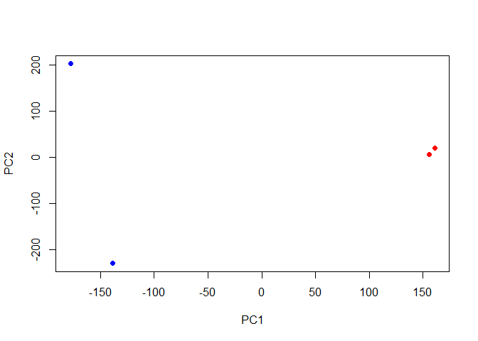
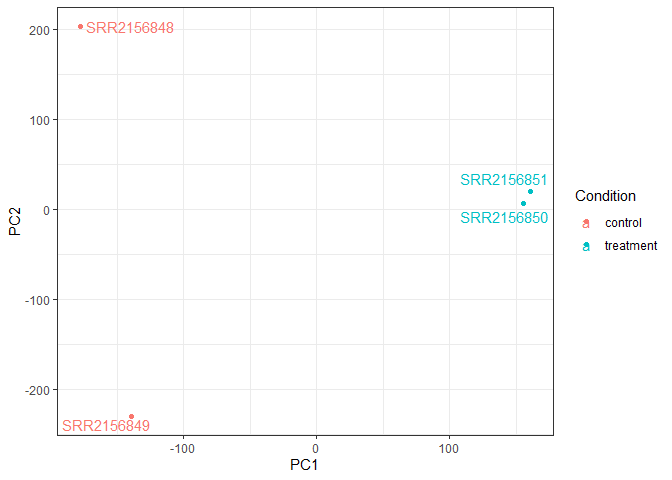
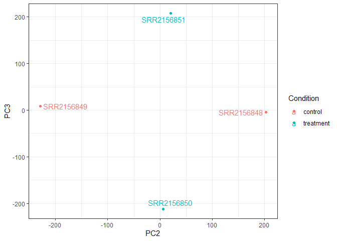

# class16
Sarah Tareen

## Working with RNA-Seq data

Q. How would you check that these files with extension ‘.fastq’ actually
look like what we expect for a FASTQ file? You could try printing the
first few lines to the shell standard output:

`head` `SRR2156848 1.fastq`

Q. How could you check the number of sequences in each file?

`grep -c "@SRR"`

2959900 sequences

Q. Check you have pairs of FASTQ files for all four datasets.

`grep *.fastq`

Q. Unzip and Untar the resulting file

`tar -zxvf kallisto_linux-v0.44.0.tar.gz`

Q. For ease of use and to avoid having to type the full PATH each time
we want to use the program we can add it’s location to our \$PATH
environment variable as we did previously for the **sra-tools** package:

`export PATH=$PATH:/home/ubuntu/kallisto_linux-v0.44.0`

Q. We can now run the quantification for the remaining samples:

`# You complete these steps`

`$ kallisto quant -i hg19.ensembl -o SRR2156849_quant SRR2156849_1.fastq SRR2156849_2.fastq`

`$ kallisto quant -i hg19.ensembl -o SRR2156850_quant SRR2156850_1.fastq SRR2156850_2.fastq`

`$ kallisto quant -i hg19.ensembl -o SRR2156851_quant SRR2156851_1.fastq SRR2156851_2.fastq`

Q. Have a look at the TSV format versions of these files to understand
their structure. What do you notice about these files contents?

The TSV files have all the IDs of the genes with the number of
transcripts and the length with each row representing a gene.

# **Downstream analysis**

``` r
# setup the folder and filenames to read
library(tximport)
library(rhdf5)
folders <- dir(pattern="SRR21568*")
samples <- sub("_quant", "", folders)
files <- file.path( folders, "abundance.h5" )
names(files) <- samples

txi.kallisto <- tximport(files, type = "kallisto", txOut = TRUE)
```

    1 2 3 4 

``` r
head(txi.kallisto$counts)
```

                    SRR2156848 SRR2156849 SRR2156850 SRR2156851
    ENST00000539570          0          0    0.00000          0
    ENST00000576455          0          0    2.62037          0
    ENST00000510508          0          0    0.00000          0
    ENST00000474471          0          1    1.00000          0
    ENST00000381700          0          0    0.00000          0
    ENST00000445946          0          0    0.00000          0

``` r
colSums(txi.kallisto$counts)
```

    SRR2156848 SRR2156849 SRR2156850 SRR2156851 
       2563611    2600800    2372309    2111474 

``` r
sum(rowSums(txi.kallisto$counts)>0)
```

    [1] 94561

``` r
to.keep <- rowSums(txi.kallisto$counts) > 0
kset.nonzero <- txi.kallisto$counts[to.keep,]
```

``` r
keep2 <- apply(kset.nonzero,1,sd)>0
x <- kset.nonzero[keep2,]
```

## **Principal Component Analysis**

``` r
pca <- prcomp(t(x), scale=TRUE)
```

``` r
summary(pca)
```

    Importance of components:
                                PC1      PC2      PC3   PC4
    Standard deviation     183.6379 177.3605 171.3020 1e+00
    Proportion of Variance   0.3568   0.3328   0.3104 1e-05
    Cumulative Proportion    0.3568   0.6895   1.0000 1e+00

``` r
plot(pca$x[,1], pca$x[,2],
     col=c("blue","blue","red","red"),
     xlab="PC1", ylab="PC2", pch=16)
```



``` r
pca.f <- as.data.frame(pca$x)
```

``` r
library(ggplot2)
library(ggrepel)

# Make metadata object for the samples
colData <- data.frame(condition = factor(rep(c("control", "treatment"), each = 2)))
rownames(colData) <- colnames(txi.kallisto$counts)

# Make the data.frame for ggplot 
y <- as.data.frame(pca$x)
y$Condition <- as.factor(colData$condition)

ggplot(y) +
  aes(PC1, PC2, col=Condition) +
  geom_point() +
  geom_text_repel(label=rownames(y)) +
  theme_bw()
```



``` r
library(ggplot2)
library(ggrepel)

# Make metadata object for the samples
colData <- data.frame(condition = factor(rep(c("control", "treatment"), each = 2)))
rownames(colData) <- colnames(txi.kallisto$counts)

# Make the data.frame for ggplot 
y <- as.data.frame(pca$x)
y$Condition <- as.factor(colData$condition)

ggplot(y) +
  aes(PC1, PC3, col=Condition) +
  geom_point() +
  geom_text_repel(label=rownames(y)) +
  theme_bw()
```


``` r
library(ggplot2)
library(ggrepel)

# Make metadata object for the samples
colData <- data.frame(condition = factor(rep(c("control", "treatment"), each = 2)))
rownames(colData) <- colnames(txi.kallisto$counts)

# Make the data.frame for ggplot 
y <- as.data.frame(pca$x)
y$Condition <- as.factor(colData$condition)

ggplot(y) +
  aes(PC2, PC3, col=Condition) +
  geom_point() +
  geom_text_repel(label=rownames(y)) +
  theme_bw()
```


